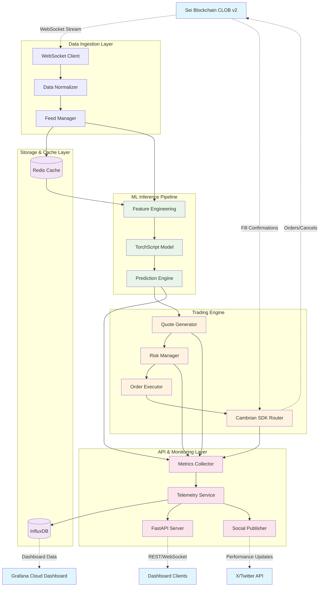
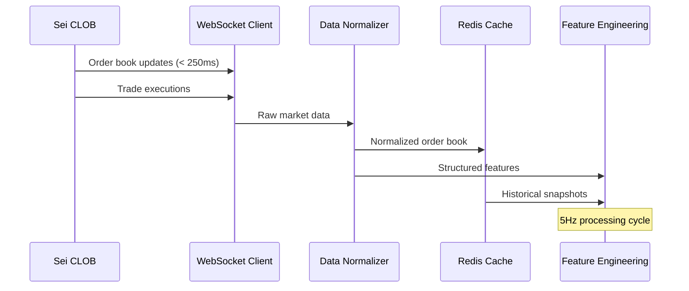
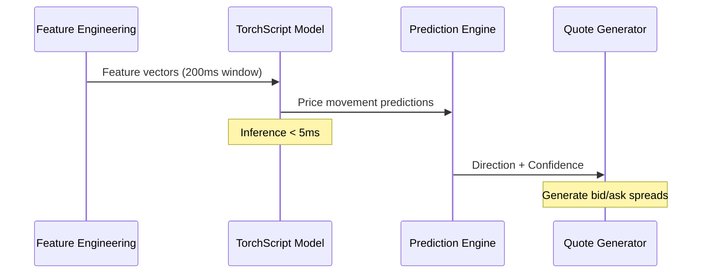
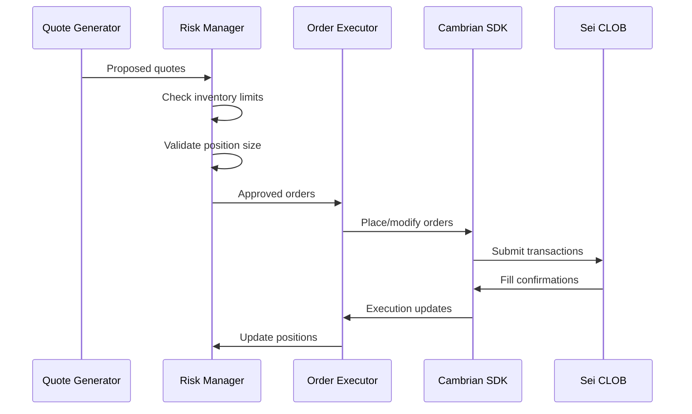
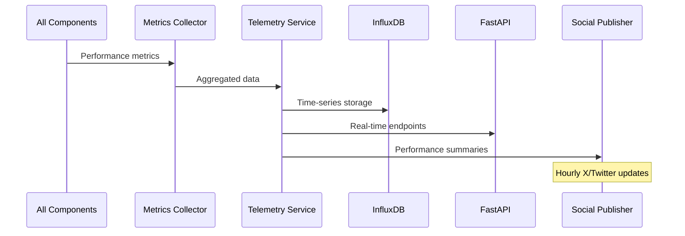
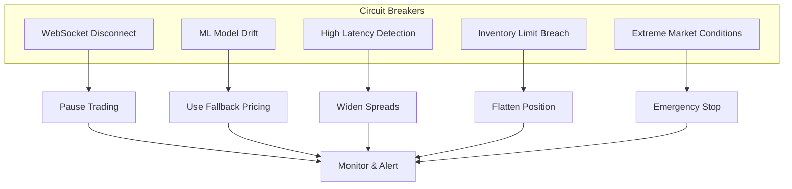

# FlashMM Technical Architecture & Data Flow

## System Architecture Overview



## Detailed Component Data Flow

### 1. Real-Time Data Pipeline



### 2. ML Inference Pipeline



### 3. Trading Execution Flow



### 4. Monitoring & Telemetry Flow



## Component Interaction Matrix

| Component | Inputs From | Outputs To | Frequency | Latency Target |
|-----------|-------------|------------|-----------|----------------|
| WebSocket Client | Sei CLOB | Data Normalizer | Real-time | < 250ms |
| Data Normalizer | WebSocket Client | Redis, Feature Engineering | Real-time | < 10ms |
| Feature Engineering | Normalizer, Redis | ML Model | 5Hz | < 20ms |
| ML Model | Feature Engineering | Prediction Engine | 5Hz | < 5ms |
| Quote Generator | Prediction Engine | Risk Manager | 5Hz | < 5ms |
| Risk Manager | Quote Generator, Position Tracker | Order Executor | 5Hz | < 10ms |
| Order Executor | Risk Manager | Cambrian SDK | As needed | < 50ms |
| Metrics Collector | All Components | Telemetry Service | 1Hz | < 100ms |
| Telemetry Service | Metrics Collector | InfluxDB, API, Social | 1Hz | < 200ms |

## Critical Path Analysis

### Hot Path (Latency Critical)
```
Sei WebSocket → Normalizer → Feature Engineering → ML Model → Quote Generator → Risk Manager → Order Executor → Cambrian SDK → Sei CLOB
```
**Total Target Latency: < 350ms end-to-end**

### Cold Path (Analytics)
```
Metrics Collector → Telemetry Service → InfluxDB → Grafana Dashboard
```
**Target Update Frequency: 1Hz**

## Failure Modes & Circuit Breakers



## Performance Requirements Summary

| Metric | Target | Measurement |
|--------|--------|-------------|
| WebSocket Latency | < 250ms | Round-trip ping |
| ML Inference Time | < 5ms | Model forward pass |
| Order Placement | < 50ms | SDK to blockchain |
| End-to-End Latency | < 350ms | Signal to order |
| System Uptime | > 98% | During demo window |
| Memory Usage | < 2GB | Peak consumption |
| Model Size | < 5MB | TorchScript export |
| Quote Frequency | 5Hz | Orders per second |