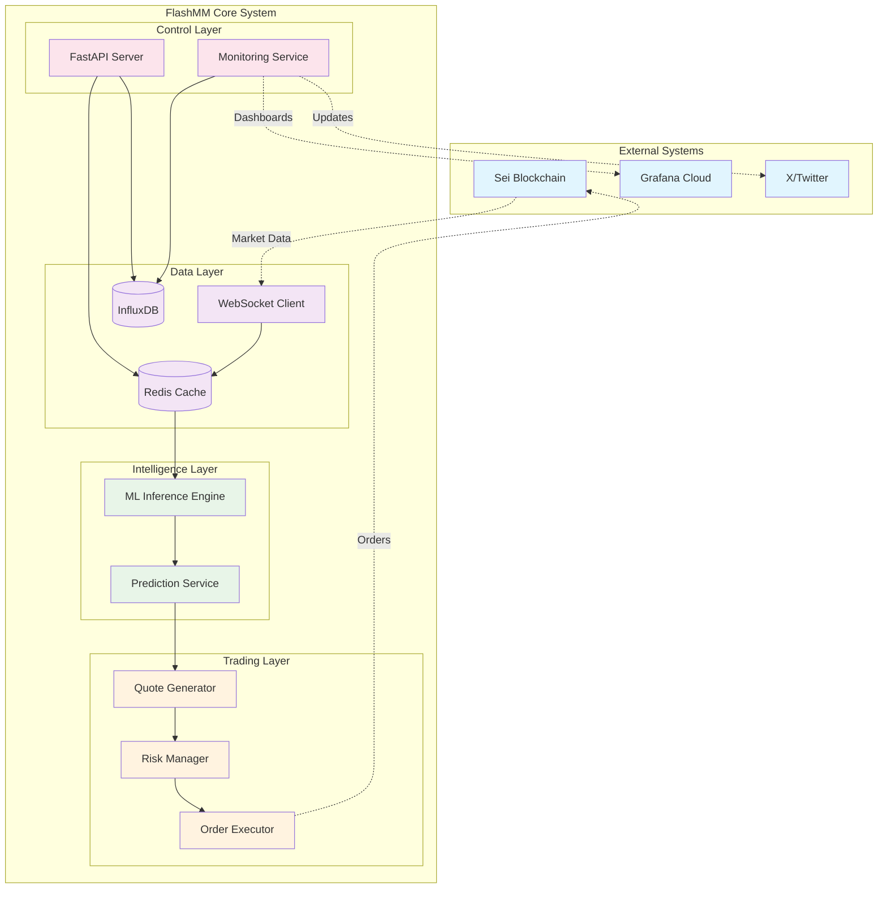
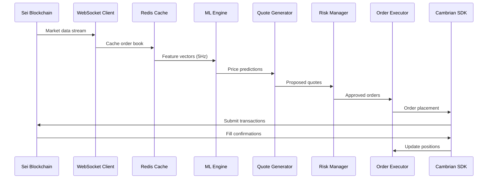

# FlashMM Architecture Overview & Implementation Guide

## Executive Summary

FlashMM is designed as a high-performance, AI-driven market-making agent for the Sei blockchain, optimized for hackathon development speed while maintaining production-quality architectural principles. The system achieves sub-350ms end-to-end latency from market data ingestion to order placement, with integrated ML prediction capabilities and comprehensive monitoring.

### Key Architectural Decisions

| Decision | Rationale | Trade-offs |
|----------|-----------|------------|
| **Python 3.11 + AsyncIO** | Fast development, native ML ecosystem, excellent async support | Slightly higher latency vs Rust/C++, but adequate for requirements |
| **Single-VPS Deployment** | Hackathon constraint, cost-effective, simplified ops | No horizontal scaling, single point of failure |
| **Docker Compose** | Rapid deployment, service isolation, development parity | Less sophisticated than Kubernetes, limited scaling |
| **TorchScript Models** | Fast inference (<5ms), compact size (<5MB), production-ready | Requires model export step, limited debugging |
| **Redis + InfluxDB** | High-performance caching + time-series storage | Memory usage for Redis, eventual consistency |
| **Cambrian SDK** | Native Sei integration, reduces development time | Vendor dependency, API rate limits |

## System Architecture

### High-Level Component Overview



### Performance Characteristics

| Component | Latency Target | Throughput | Memory Usage |
|-----------|----------------|------------|--------------|
| Data Ingestion | <250ms | 50 msgs/sec | 100MB |
| ML Inference | <5ms | 5 Hz | 200MB |
| Quote Generation | <5ms | 5 Hz | 50MB |
| Order Execution | <50ms | 10 orders/sec | 100MB |
| **Total System** | **<350ms** | **5 Hz** | **<2GB** |

## Architectural Principles

### 1. Latency-First Design
- **Hot Path Optimization**: Critical trading path optimized for <350ms end-to-end
- **Async Everything**: Full async/await pattern throughout the stack
- **Minimal Serialization**: Direct Python object passing where possible
- **Connection Pooling**: Persistent connections to external services

### 2. Fault Tolerance
- **Circuit Breakers**: Automatic failover when external services degrade
- **Graceful Degradation**: System continues operating with reduced functionality
- **Emergency Stops**: Multiple levels of emergency controls
- **Data Redundancy**: Critical data replicated across Redis and InfluxDB

### 3. Observability
- **Structured Logging**: JSON-formatted logs with correlation IDs
- **Metrics Everything**: Comprehensive metrics collection at 1Hz
- **Distributed Tracing**: Request tracing across components
- **Real-time Dashboards**: Live system status via Grafana

### 4. Security by Design
- **Defense in Depth**: Multiple security layers
- **Principle of Least Privilege**: Minimal required permissions
- **Encryption at Rest**: Sensitive data encrypted in storage
- **Audit Trail**: Complete audit log of all operations

## Implementation Strategy

### Phase 1: Core Infrastructure (Week 1)
**Goal**: Establish basic data pipeline and trading skeleton

**Deliverables**:
- [x] Project structure and development environment
- [x] Docker Compose setup with Redis + InfluxDB
- [x] WebSocket client for Sei market data
- [x] Basic order placement via Cambrian SDK
- [x] Health monitoring and logging

**Architecture Focus**: [`project-structure.md`](project-structure.md), [`deployment-workflows.md`](deployment-workflows.md)

### Phase 2: ML Integration (Week 2)
**Goal**: Implement prediction engine and model inference

**Deliverables**:
- [ ] Feature engineering pipeline
- [ ] TorchScript model loader and inference engine
- [ ] Model training and export scripts
- [ ] Backtesting framework
- [ ] Performance benchmarking

**Architecture Focus**: [`technology-stack.md`](technology-stack.md), [`external-integrations.md`](external-integrations.md)

### Phase 3: Trading Logic (Week 3)
**Goal**: Complete market-making strategy and risk management

**Deliverables**:
- [ ] Quote generation algorithms
- [ ] Inventory tracking and position management
- [ ] Risk controls and circuit breakers
- [ ] Order lifecycle management
- [ ] PnL calculation and reporting

**Architecture Focus**: [`api-specifications.md`](api-specifications.md), [`security-architecture.md`](security-architecture.md)

### Phase 4: Production Readiness (Week 4)
**Goal**: Deploy, monitor, and optimize for demo

**Deliverables**:
- [ ] VPS deployment and monitoring
- [ ] Grafana dashboard configuration
- [ ] Twitter bot for social updates
- [ ] Performance optimization
- [ ] Demo preparation and testing

**Architecture Focus**: [`configuration-management.md`](configuration-management.md), [`architecture-diagram.md`](architecture-diagram.md)

## Critical Success Factors

### Technical Requirements Achievement

| Requirement | Target | Architecture Decision | Risk Level |
|-------------|--------|----------------------|------------|
| **End-to-End Latency** | <350ms | Async Python + Redis caching | 🟡 Medium |
| **Model Inference** | <5ms | TorchScript + CPU optimization | 🟢 Low |
| **Spread Improvement** | ≥40% | ML-driven quote optimization | 🟡 Medium |
| **Inventory Control** | ±2% notional | Real-time position tracking | 🟢 Low |
| **System Uptime** | >98% | Circuit breakers + health monitoring | 🟡 Medium |
| **Model Size** | <5MB | Compressed TorchScript export | 🟢 Low |

### Development Velocity Optimizations

1. **Rapid Prototyping**: Python ecosystem enables fast iteration
2. **Container-First**: Docker Compose for consistent environments
3. **Mock-Friendly**: Extensive mocking for testing without external deps
4. **Hot Reloading**: Development mode with file watching
5. **Pre-built Components**: Leverage existing libraries (FastAPI, PyTorch, etc.)

## Risk Assessment & Mitigation

### High-Risk Areas

#### 1. Latency Requirements (🔴 High Risk)
**Risk**: End-to-end latency exceeds 350ms target
**Mitigation**: 
- Performance profiling at each development milestone
- Async optimization throughout the stack
- Redis caching for frequently accessed data
- Connection pooling for external APIs

#### 2. Model Performance (🟠 Medium Risk) 
**Risk**: ML model prediction accuracy <55%
**Mitigation**:
- Multiple model architectures (LSTM, Transformer, Ensemble)
- Extensive backtesting with historical data
- Confidence thresholds for trade execution
- Fallback to simple market-making without predictions

#### 3. External Dependencies (🟠 Medium Risk)
**Risk**: Sei RPC or Cambrian SDK downtime
**Mitigation**:
- Multiple RPC endpoint failover
- Circuit breakers with exponential backoff
- Graceful degradation modes
- Emergency stop procedures

### Medium-Risk Areas

#### 1. Resource Constraints (🟡 Medium Risk)
**Risk**: Single VPS insufficient for performance requirements
**Mitigation**:
- Resource monitoring and alerting
- Memory optimization in Python
- Efficient data structures and algorithms
- Process-level resource limits

#### 2. Security Vulnerabilities (🟡 Medium Risk)
**Risk**: Key compromise or unauthorized access
**Mitigation**:
- Multi-tier key management (hot/warm/cold)
- Regular key rotation procedures
- Network segmentation and firewalls
- Comprehensive audit logging

## Technology Integration Points

### Core Dependencies

```python
# Key technology versions and integration points
CORE_STACK = {
    "runtime": "Python 3.11+",
    "async_framework": "asyncio + uvloop",
    "web_framework": "FastAPI 0.100+",
    "ml_framework": "PyTorch 2.0+", 
    "data_storage": "Redis 7.0 + InfluxDB 2.7",
    "containerization": "Docker + Docker Compose",
    "monitoring": "Grafana Cloud + Prometheus metrics"
}

EXTERNAL_INTEGRATIONS = {
    "blockchain": "Sei v2 testnet (WebSocket + REST)",
    "trading": "Cambrian Python SDK 0.4+",
    "monitoring": "Grafana Cloud API",
    "social": "Twitter API v2"
}
```

### Data Flow Architecture



## Deployment Architecture

### Single-VPS Configuration

```yaml
# Production deployment architecture
VPS_SPECIFICATIONS:
  provider: "AWS/GCP/DigitalOcean"
  instance_type: "4 vCPU, 8GB RAM, 50GB SSD"
  location: "Singapore/Tokyo (low latency to Sei)"
  os: "Ubuntu 22.04 LTS"
  
CONTAINER_LAYOUT:
  flashmm_app:
    resources: "2 CPU, 4GB RAM"
    ports: [8000]
  redis:
    resources: "1 CPU, 2GB RAM" 
    persistence: false
  influxdb:
    resources: "1 CPU, 2GB RAM"
    retention: "7 days"
  nginx:
    resources: "0.5 CPU, 512MB RAM"
    ssl: "Let's Encrypt"
```

### Monitoring & Alerting

```yaml
GRAFANA_DASHBOARD:
  panels:
    - "Real-time PnL"
    - "Spread improvement vs baseline"
    - "Order fill rates"
    - "System latency (p95, p99)"
    - "ML model confidence"
    - "Position utilization"
    
ALERT_THRESHOLDS:
  high_latency: ">500ms p95"
  position_limit: ">90% of max position"
  model_confidence: "<0.6 average"
  error_rate: ">5% in 5 minutes"
  system_downtime: ">30 seconds"
```

## Development Workflow

### Git Workflow
```
main branch → production deployments
develop branch → integration testing  
feature branches → individual development
hotfix branches → emergency fixes
```

### Testing Strategy
```python
# Test pyramid approach
TESTING_LEVELS = {
    "unit_tests": "70% coverage, fast execution (<1s)",
    "integration_tests": "key component interactions", 
    "end_to_end_tests": "full system scenarios",
    "performance_tests": "latency and throughput validation"
}
```

### CI/CD Pipeline
1. **Code Quality**: Linting, type checking, security scanning
2. **Testing**: Unit → Integration → E2E tests
3. **Build**: Docker image creation and optimization
4. **Deploy**: Automated deployment with health checks
5. **Monitor**: Post-deployment verification and alerting

## Success Metrics & KPIs

### Primary Success Metrics (Demo Requirements)

| Metric | Target | Measurement Method |
|--------|--------|-------------------|
| **Spread Improvement** | ≥40% vs baseline | Before/after comparison during 1-hour demo window |
| **System Uptime** | >98% | Grafana dashboard during judging period |
| **Prediction Accuracy** | >55% directional | Backtesting + live performance tracking |
| **Inventory Control** | ±2% notional | Real-time position monitoring |

### Secondary Performance Metrics

| Metric | Target | Purpose |
|--------|--------|---------|
| End-to-End Latency | <350ms p95 | System responsiveness |
| Order Fill Rate | >80% | Market making effectiveness |
| Daily Sharpe Ratio | >1.0 | Risk-adjusted returns |
| API Error Rate | <1% | System reliability |

## Documentation Reference

This architecture overview ties together the following detailed specifications:

1. **[`project-structure.md`](project-structure.md)** - Complete directory structure and file organization
2. **[`architecture-diagram.md`](architecture-diagram.md)** - Detailed system diagrams and data flow
3. **[`technology-stack.md`](technology-stack.md)** - Technology choices and specifications
4. **[`api-specifications.md`](api-specifications.md)** - Internal and external API design
5. **[`configuration-management.md`](configuration-management.md)** - Environment and config strategy
6. **[`deployment-workflows.md`](deployment-workflows.md)** - CI/CD and deployment procedures
7. **[`external-integrations.md`](external-integrations.md)** - Third-party service integration
8. **[`security-architecture.md`](security-architecture.md)** - Security controls and key management

## Next Steps

### Immediate Actions (Next 24 Hours)
1. **Team Alignment**: Review architecture with development team
2. **Environment Setup**: Initialize development environments per [`deployment-workflows.md`](deployment-workflows.md)
3. **Repository Creation**: Set up Git repository with structure from [`project-structure.md`](project-structure.md)
4. **Dependency Installation**: Configure Python environment and Docker Compose

### Week 1 Sprint Planning
1. **Data Pipeline**: Implement Sei WebSocket client and Redis integration
2. **Basic Trading**: Set up Cambrian SDK integration and order placement
3. **Monitoring**: Configure logging and basic health endpoints  
4. **Testing**: Establish testing framework and CI pipeline

### Risk Monitoring
- **Daily latency checks**: Ensure performance targets are achievable
- **Weekly architecture reviews**: Adapt design based on development learnings
- **Integration testing**: Validate external service reliability early and often

This architecture provides a solid foundation for building FlashMM while maintaining flexibility to adapt as development progresses and new requirements emerge during the hackathon.