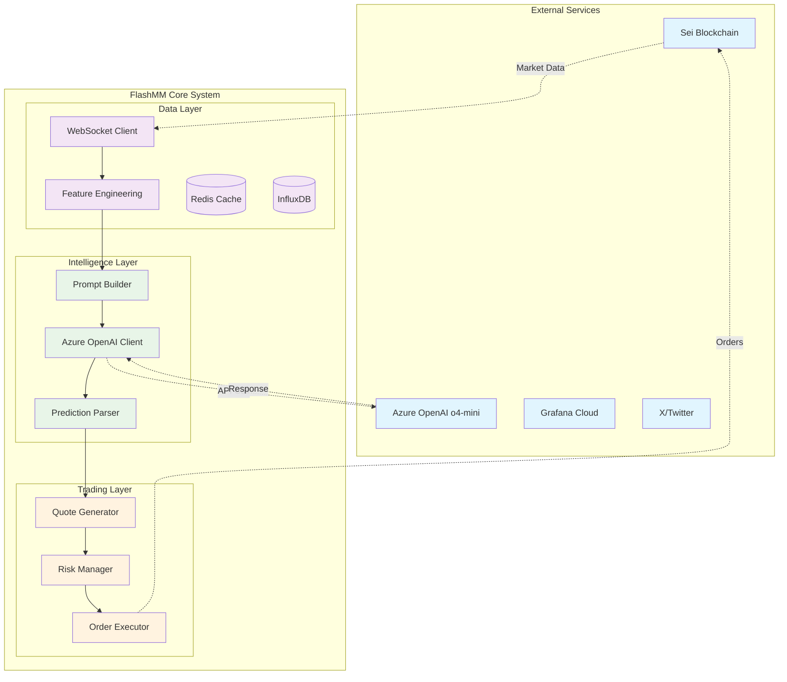

# Azure OpenAI Integration Architecture Update

## Overview
FlashMM architecture updated to use Azure OpenAI o4-mini model instead of local PyTorch models for ML predictions. This change affects the ML pipeline, latency targets, cost structure, and reliability considerations.

## Architectural Changes

### Original vs Updated ML Architecture

#### Before: Local PyTorch Models
```
Feature Engineering → PyTorch Model → TorchScript Inference → Predictions
Target Latency: <5ms | Model Size: <5MB | Cost: Compute only
```

#### After: Azure OpenAI API
```
Feature Engineering → Azure OpenAI API → o4-mini Model → Predictions  
Target Latency: <100ms | Model Size: N/A | Cost: API calls
```

### Updated System Architecture



## Updated Technology Stack

### ML/AI Components
```python
# Updated dependencies
AZURE_OPENAI_STACK = {
    "azure_openai": "openai>=1.0.0",
    "azure_identity": "azure-identity>=1.15.0", 
    "http_client": "aiohttp>=3.8.0",
    "prompt_engineering": "langchain>=0.0.300",  # Optional
    "response_parsing": "pydantic>=2.0.0"
}

# Removed dependencies
REMOVED_DEPENDENCIES = [
    "torch",
    "torchvision", 
    "torchscript",
    "scikit-learn"  # May still need for feature engineering
]
```

### Azure OpenAI Client Configuration
```python
class AzureOpenAIConfig:
    """Configuration for Azure OpenAI integration"""
    
    endpoint: str = "https://your-resource.openai.azure.com/"
    api_key: str = os.getenv("AZURE_OPENAI_API_KEY")
    api_version: str = "2024-02-15-preview"
    model_deployment: str = "o4-mini-deployment"  # Your deployment name
    
    # Performance settings
    max_tokens: int = 150
    temperature: float = 0.1  # Low temperature for consistent predictions
    timeout_seconds: int = 10  # Aggressive timeout for trading
    
    # Rate limiting
    requests_per_minute: int = 1000  # Adjust based on quota
    concurrent_requests: int = 10
    
    # Retry settings
    max_retries: int = 3
    retry_delay: float = 0.1  # 100ms between retries
```

## Prompt Engineering for Market Prediction

### Market Data Prompt Template
```python
class MarketPredictionPrompt:
    """Structured prompt for market prediction using o4-mini"""
    
    SYSTEM_PROMPT = """
You are a quantitative trading assistant specializing in short-term price prediction for cryptocurrency markets. 

Analyze the provided market data and predict the price direction for the next 100-500ms timeframe.

Response format (JSON only):
{
    "direction": "bullish|bearish|neutral",
    "confidence": 0.0-1.0,
    "price_change_bps": -500 to +500,
    "reasoning": "brief explanation"
}

Focus on:
- Order book imbalance and depth
- Recent trade momentum  
- Bid-ask spread dynamics
- Volume patterns

Be concise and deterministic in your analysis.
"""
    
    def build_market_prompt(self, market_data: Dict) -> str:
        """Build market analysis prompt"""
        
        prompt = f"""
Current Market Data for {market_data['symbol']}:

Order Book:
- Best Bid: ${market_data['best_bid']:.4f} (Size: {market_data['bid_size']})
- Best Ask: ${market_data['best_ask']:.4f} (Size: {market_data['ask_size']})  
- Mid Price: ${market_data['mid_price']:.4f}
- Spread: {market_data['spread_bps']:.1f} bps

Recent Trades (last 10):
{self._format_recent_trades(market_data['recent_trades'])}

Order Book Depth (L2):
Bids: {self._format_book_levels(market_data['bids'][:5])}
Asks: {self._format_book_levels(market_data['asks'][:5])}

Market Metrics:
- Volume (1m): ${market_data['volume_1m']:,.0f}
- Price Change (1m): {market_data['price_change_1m_bps']:.1f} bps
- Trade Count (1m): {market_data['trade_count_1m']}

Predict price direction for the next 200ms.
"""
        return prompt
```

### Response Processing
```python
class PredictionResponseParser:
    """Parse and validate Azure OpenAI responses"""
    
    async def parse_prediction(self, response: str) -> Prediction:
        """Parse AI response into structured prediction"""
        
        try:
            # Extract JSON from response
            response_data = json.loads(response.strip())
            
            # Validate required fields
            required_fields = ["direction", "confidence", "price_change_bps"]
            missing_fields = [f for f in required_fields if f not in response_data]
            if missing_fields:
                raise ValueError(f"Missing fields: {missing_fields}")
            
            # Create prediction object
            prediction = Prediction(
                timestamp=datetime.utcnow(),
                direction=response_data["direction"],
                confidence=float(response_data["confidence"]),
                price_change_bps=float(response_data["price_change_bps"]),
                reasoning=response_data.get("reasoning", ""),
                model_version="azure-openai-o4-mini",
                response_time_ms=0  # Will be set by caller
            )
            
            # Validate ranges
            if not 0 <= prediction.confidence <= 1:
                raise ValueError(f"Invalid confidence: {prediction.confidence}")
            
            if abs(prediction.price_change_bps) > 500:
                raise ValueError(f"Price change too large: {prediction.price_change_bps}")
            
            return prediction
            
        except (json.JSONDecodeError, ValueError, KeyError) as e:
            logger.error(f"Failed to parse prediction response: {e}")
            # Return neutral prediction as fallback
            return Prediction(
                timestamp=datetime.utcnow(),
                direction="neutral",
                confidence=0.5,
                price_change_bps=0.0,
                reasoning=f"Parse error: {str(e)}",
                model_version="azure-openai-o4-mini-fallback"
            )
```

## Azure OpenAI Client Implementation

### Async Client with Connection Pooling
```python
import aiohttp
from azure.identity import DefaultAzureCredential
from openai import AsyncAzureOpenAI

class AzureOpenAIClient:
    """High-performance Azure OpenAI client for trading"""
    
    def __init__(self, config: AzureOpenAIConfig):
        self.config = config
        self.client = None
        self.session = None
        self.rate_limiter = asyncio.Semaphore(config.concurrent_requests)
        
        # Performance tracking
        self.request_count = 0
        self.total_latency = 0.0
        self.error_count = 0
    
    async def initialize(self):
        """Initialize Azure OpenAI client"""
        
        # Setup HTTP session with connection pooling
        connector = aiohttp.TCPConnector(
            limit=20,  # Total connection pool size
            limit_per_host=10,  # Per-host connection limit
            ttl_dns_cache=300,  # DNS cache TTL
            use_dns_cache=True,
        )
        
        timeout = aiohttp.ClientTimeout(total=self.config.timeout_seconds)
        self.session = aiohttp.ClientSession(
            connector=connector,
            timeout=timeout,
            headers={"User-Agent": "FlashMM/1.0"}
        )
        
        # Initialize Azure OpenAI client
        self.client = AsyncAzureOpenAI(
            azure_endpoint=self.config.endpoint,
            api_key=self.config.api_key,
            api_version=self.config.api_version,
            http_client=self.session
        )
        
        logger.info("Azure OpenAI client initialized")
        
    async def predict_market_direction(self, market_data: Dict) -> Prediction:
        """Get market prediction from Azure OpenAI"""
        
        start_time = time.time()
        
        async with self.rate_limiter:
            try:
                # Build prompt
                prompt_builder = MarketPredictionPrompt()
                user_prompt = prompt_builder.build_market_prompt(market_data)
                
                # Make API call with retry logic
                response = await self._call_with_retry(
                    system_prompt=prompt_builder.SYSTEM_PROMPT,
                    user_prompt=user_prompt
                )
                
                # Parse response
                parser = PredictionResponseParser()
                prediction = await parser.parse_prediction(response)
                
                # Update performance metrics
                response_time = (time.time() - start_time) * 1000
                prediction.response_time_ms = response_time
                
                self._update_metrics(response_time, success=True)
                
                return prediction
                
            except Exception as e:
                self._update_metrics(time.time() - start_time, success=False)
                logger.error(f"Azure OpenAI prediction failed: {e}")
                
                # Return fallback neutral prediction
                return Prediction(
                    timestamp=datetime.utcnow(),
                    direction="neutral", 
                    confidence=0.5,
                    price_change_bps=0.0,
                    reasoning=f"API error: {str(e)}",
                    model_version="azure-openai-fallback",
                    response_time_ms=(time.time() - start_time) * 1000
                )
    
    async def _call_with_retry(self, system_prompt: str, user_prompt: str) -> str:
        """Make API call with exponential backoff retry"""
        
        for attempt in range(self.config.max_retries):
            try:
                response = await self.client.chat.completions.create(
                    model=self.config.model_deployment,
                    messages=[
                        {"role": "system", "content": system_prompt},
                        {"role": "user", "content": user_prompt}
                    ],
                    max_tokens=self.config.max_tokens,
                    temperature=self.config.temperature,
                    timeout=self.config.timeout_seconds
                )
                
                return response.choices[0].message.content
                
            except Exception as e:
                if attempt == self.config.max_retries - 1:
                    raise  # Last attempt failed
                
                # Exponential backoff
                delay = self.config.retry_delay * (2 ** attempt)
                await asyncio.sleep(delay)
                logger.warning(f"Azure OpenAI retry {attempt + 1}: {e}")
    
    def _update_metrics(self, response_time: float, success: bool):
        """Update performance metrics"""
        self.request_count += 1
        self.total_latency += response_time
        
        if not success:
            self.error_count += 1
    
    @property
    def average_latency_ms(self) -> float:
        """Get average response latency"""
        if self.request_count == 0:
            return 0.0
        return self.total_latency / self.request_count
    
    @property 
    def error_rate(self) -> float:
        """Get error rate percentage"""
        if self.request_count == 0:
            return 0.0
        return (self.error_count / self.request_count) * 100
```

## Updated Performance Targets

### Revised Latency Expectations
| Component | Original Target | Updated Target | Impact |
|-----------|----------------|----------------|---------|
| ML Inference | <5ms | <100ms | +95ms (API latency) |
| End-to-End | <350ms | <450ms | +100ms total |
| Quote Frequency | 5Hz | 3-4Hz | Reduced due to latency |

### Cost Considerations
```python
# Estimated API costs (Azure OpenAI pricing)
COST_ESTIMATES = {
    "o4_mini_input_tokens": 0.000150,  # per 1K tokens
    "o4_mini_output_tokens": 0.000600,  # per 1K tokens
    "average_tokens_per_request": 500,  # input + output
    "requests_per_hour": 10800,  # 3Hz * 3600s
    "estimated_hourly_cost": 2.70,  # USD
    "estimated_daily_cost": 64.80   # USD for 24h operation
}
```

## Security Updates

### Azure OpenAI Key Management
```python
# Updated security configuration
AZURE_SECURITY = {
    "api_key": {
        "storage": "environment_variable",
        "rotation": "weekly",
        "encryption": True
    },
    "endpoint": {
        "whitelist_ips": True,
        "private_endpoint": False  # Consider for production
    },
    "logging": {
        "audit_requests": True,
        "mask_sensitive_data": True
    }
}

# Environment variables
AZURE_OPENAI_API_KEY=your_api_key_here
AZURE_OPENAI_ENDPOINT=https://your-resource.openai.azure.com/
AZURE_OPENAI_DEPLOYMENT=o4-mini-deployment
```

## Reliability & Fallback Strategy

### Circuit Breaker for Azure OpenAI
```python
class AzureOpenAICircuitBreaker:
    """Circuit breaker for Azure OpenAI API calls"""
    
    def __init__(self):
        self.failure_threshold = 5  # failures before opening
        self.timeout_seconds = 30   # how long to stay open
        self.failure_count = 0
        self.last_failure_time = None
        self.state = "CLOSED"  # CLOSED, OPEN, HALF_OPEN
    
    async def call_with_fallback(self, prediction_func, market_data: Dict) -> Prediction:
        """Call Azure OpenAI with circuit breaker and fallback"""
        
        if self.state == "OPEN":
            if time.time() - self.last_failure_time > self.timeout_seconds:
                self.state = "HALF_OPEN"
            else:
                # Return rule-based fallback
                return self._rule_based_fallback(market_data)
        
        try:
            prediction = await prediction_func(market_data)
            
            # Success - reset circuit breaker
            if self.state == "HALF_OPEN":
                self.state = "CLOSED"
                self.failure_count = 0
            
            return prediction
            
        except Exception as e:
            self.failure_count += 1
            self.last_failure_time = time.time()
            
            if self.failure_count >= self.failure_threshold:
                self.state = "OPEN"
                logger.warning("Azure OpenAI circuit breaker opened")
            
            # Return fallback prediction
            return self._rule_based_fallback(market_data)
    
    def _rule_based_fallback(self, market_data: Dict) -> Prediction:
        """Simple rule-based prediction when API is unavailable"""
        
        # Basic market making logic
        spread_bps = market_data.get('spread_bps', 50)
        volume_ratio = market_data.get('bid_size', 0) / max(market_data.get('ask_size', 1), 1)
        
        if spread_bps > 100:  # Wide spread - neutral
            direction = "neutral"
            confidence = 0.6
        elif volume_ratio > 1.5:  # More bids - bullish
            direction = "bullish" 
            confidence = 0.7
        elif volume_ratio < 0.5:  # More asks - bearish
            direction = "bearish"
            confidence = 0.7
        else:
            direction = "neutral"
            confidence = 0.5
        
        return Prediction(
            timestamp=datetime.utcnow(),
            direction=direction,
            confidence=confidence,
            price_change_bps=0.0,  # Conservative fallback
            reasoning="Rule-based fallback (API unavailable)",
            model_version="fallback-rules-v1"
        )
```

## Implementation Priority

### Updated Week 1 Sprint
1. **Azure OpenAI Integration**: Set up client and prompt engineering
2. **API Testing**: Validate latency and reliability 
3. **Fallback System**: Implement circuit breaker and rule-based backup
4. **Cost Monitoring**: Track API usage and costs

### Key Risks to Monitor
1. **Latency Impact**: May not achieve original <350ms target
2. **API Reliability**: Dependency on external service
3. **Cost Control**: Monitor API usage to avoid budget overrun
4. **Rate Limits**: Ensure we stay within Azure OpenAI quotas

This architectural update maintains the core system design while adapting to use Azure OpenAI o4-mini for ML predictions instead of local models.