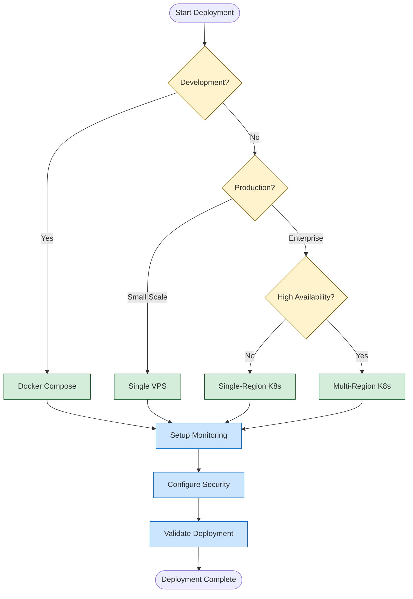

# FlashMM Comprehensive Deployment Guide

## Table of Contents
- [Overview](#overview)
- [Prerequisites](#prerequisites)
- [Environment Setup](#environment-setup)
- [Development Deployment](#development-deployment)
- [Staging Deployment](#staging-deployment)
- [Production Deployment](#production-deployment)
- [Cloud Provider Specific Guides](#cloud-provider-specific-guides)
- [Monitoring and Observability](#monitoring-and-observability)
- [Security Configuration](#security-configuration)
- [Performance Tuning](#performance-tuning)
- [Troubleshooting](#troubleshooting)
- [Maintenance and Updates](#maintenance-and-updates)

---

## Overview

FlashMM supports multiple deployment strategies designed for different use cases and environments:

| Deployment Type | Use Case | Complexity | Scalability | HA Support |
|----------------|----------|------------|-------------|------------|
| **Docker Compose** | Development, Demos | ⭐⭐☆☆☆ | Low | ❌ |
| **Single VPS** | Small Production | ⭐⭐⭐☆☆ | Medium | ❌ |
| **Kubernetes** | Enterprise | ⭐⭐⭐⭐☆ | High | ✅ |
| **Multi-Cloud** | Mission Critical | ⭐⭐⭐⭐⭐ | Very High | ✅ |

### Architecture Decision Matrix



---

## Prerequisites

### Hardware Requirements

#### Minimum Requirements (Development)
```yaml
Development Environment:
  CPU: 2 cores (2.0 GHz+)
  Memory: 4 GB RAM
  Storage: 20 GB SSD
  Network: 10 Mbps
  OS: Linux/macOS/Windows with Docker
```

#### Recommended Requirements (Production)
```yaml
Production Environment:
  CPU: 4 cores (3.0 GHz+)
  Memory: 8 GB RAM
  Storage: 50 GB NVMe SSD
  Network: 100 Mbps (low latency to Sei network)
  OS: Ubuntu 22.04 LTS
```

#### High-Performance Requirements (Enterprise)
```yaml
Enterprise Environment:
  CPU: 16+ cores (3.5 GHz+)
  Memory: 32+ GB RAM
  Storage: 200+ GB NVMe SSD
  Network: 1 Gbps (multi-region deployment)
  OS: Ubuntu 22.04 LTS with optimizations
```

### Software Dependencies

#### Core Tools
```bash
# Required for all deployments
docker >= 20.10.0
docker-compose >= 2.0.0
git >= 2.30.0
curl >= 7.68.0

# Required for Kubernetes deployments
kubectl >= 1.24.0
helm >= 3.10.0

# Required for Infrastructure as Code
terraform >= 1.5.0
ansible >= 4.0.0  # Optional: for configuration management

# Cloud CLI tools (choose based on provider)
aws-cli >= 2.0.0    # For AWS deployments
gcloud >= 400.0.0   # For GCP deployments
az >= 2.40.0        # For Azure deployments
```

#### Installation Script
```bash
#!/bin/bash
# scripts/install-prerequisites.sh

set -euo pipefail

echo "🚀 Installing FlashMM deployment prerequisites..."

# Detect OS
if [[ "$OSTYPE" == "linux-gnu"* ]]; then
    OS="linux"
    DISTRO=$(lsb_release -si 2>/dev/null || echo "Unknown")
elif [[ "$OSTYPE" == "darwin"* ]]; then
    OS="macos"
else
    echo "❌ Unsupported OS: $OSTYPE"
    exit 1
fi

# Install Docker
install_docker() {
    echo "📦 Installing Docker..."
    if [[ "$OS" == "linux" ]]; then
        curl -fsSL https://get.docker.com -o get-docker.sh
        sudo sh get-docker.sh
        sudo usermod -aG docker $USER
        rm get-docker.sh
    elif [[ "$OS" == "macos" ]]; then
        echo "Please install Docker Desktop from https://docker.com/products/docker-desktop"
        exit 1
    fi
}

# Install kubectl
install_kubectl() {
    echo "📦 Installing kubectl..."
    curl -LO "https://dl.k8s.io/release/$(curl -L -s https://dl.k8s.io/release/stable.txt)/bin/$OS/amd64/kubectl"
    chmod +x kubectl
    sudo mv kubectl /usr/local/bin/
}

# Install Helm
install_helm() {
    echo "📦 Installing Helm..."
    curl https://raw.githubusercontent.com/helm/helm/main/scripts/get-helm-3 | bash
}

# Install Terraform
install_terraform() {
    echo "📦 Installing Terraform..."
    wget -O- https://apt.releases.hashicorp.com/gpg | gpg --dearmor | sudo tee /usr/share/keyrings/hashicorp-archive-keyring.gpg
    echo "deb [signed-by=/usr/share/keyrings/hashicorp-archive-keyring.gpg] https://apt.releases.hashicorp.com $(lsb_release -cs) main" | sudo tee /etc/apt/sources.list.d/hashicorp.list
    sudo apt update && sudo apt install terraform
}

# Check if tools exist, install if missing
check_and_install() {
    local tool=$1
    local install_func=$2
    
    if ! command -v $tool &> /dev/null; then
        echo "⚠️  $tool not found, installing..."
        $install_func
    else
        echo "✅ $tool is already installed"
    fi
}

# Main installation
check_and_install docker install_docker
check_and_install kubectl install_kubectl
check_and_install helm install_helm
check_and_install terraform install_terraform

echo "✅ Prerequisites installation completed!"
echo "📌 Please log out and back in to activate Docker group membership"
```

---

## Environment Setup

### Configuration Management Strategy

FlashMM uses a hierarchical configuration system:

```
Configuration Priority (highest to lowest):
1. Runtime environment variables
2. Environment-specific config files
3. Default configuration values
4. Fallback hardcoded values
```

#### Environment Structure
```
environments/
├── development/
│   ├── values.yaml          # Helm values for development
│   ├── .env.development     # Environment variables
│   └── config.yaml          # Application config
├── staging/
│   ├── values.yaml          # Helm values for staging
│   ├── .env.staging         # Environment variables
│   └── config.yaml          # Application config
├── production/
│   ├── values.yaml          # Helm values for production
│   ├── .env.production      # Environment variables
│   └── config.yaml          # Application config
└── deploy.sh                # Universal deployment script
```

### Environment Variable Configuration

#### Development Environment
```bash
# environments/development/.env.development
ENVIRONMENT=development
FLASHMM_DEBUG=true
FLASHMM_LOG_LEVEL=DEBUG

# Sei Network Configuration
SEI_NETWORK=testnet
SEI_RPC_URL=https://sei-testnet-rpc.polkachu.com
SEI_WS_URL=wss://sei-testnet-rpc.polkachu.com/websocket
SEI_CHAIN_ID=atlantic-2

# Trading Configuration
TRADING_ENABLED=false
PAPER_TRADING=true
TRADING_MAX_POSITION_USDC=100
TRADING_QUOTE_FREQUENCY_HZ=1

# Storage Configuration
REDIS_URL=redis://localhost:6379/0
INFLUXDB_URL=http://localhost:8086
INFLUXDB_TOKEN=dev-token-please-change
INFLUXDB_ORG=flashmm-dev
INFLUXDB_BUCKET=metrics-dev

# ML Configuration
ML_MODEL_PATH=./models/
ML_INFERENCE_FREQUENCY_HZ=1
AZURE_OPENAI_ENABLED=false

# Monitoring Configuration
GRAFANA_URL=http://localhost:3000
PROMETHEUS_URL=http://localhost:9090
METRICS_ENABLED=true
SOCIAL_PUBLISHING_ENABLED=false

# Security Configuration
JWT_SECRET_KEY=dev-secret-key-change-in-production
API_RATE_LIMIT_ENABLED=false
```

#### Staging Environment
```bash
# environments/staging/.env.staging
ENVIRONMENT=staging
FLASHMM_DEBUG=false
FLASHMM_LOG_LEVEL=INFO

# Sei Network Configuration
SEI_NETWORK=testnet
SEI_RPC_URL=https://sei-testnet-rpc.polkachu.com
SEI_WS_URL=wss://sei-testnet-rpc.polkachu.com/websocket
SEI_CHAIN_ID=atlantic-2

# Trading Configuration
TRADING_ENABLED=true
PAPER_TRADING=false
TRADING_MAX_POSITION_USDC=1000
TRADING_QUOTE_FREQUENCY_HZ=5

# Storage Configuration
REDIS_URL=redis://staging-redis:6379/0
INFLUXDB_URL=http://staging-influxdb:8086
INFLUXDB_TOKEN=${INFLUXDB_TOKEN}  # From secrets
INFLUXDB_ORG=flashmm-staging
INFLUXDB_BUCKET=metrics-staging

# ML Configuration
ML_MODEL_PATH=./models/
ML_INFERENCE_FREQUENCY_HZ=5
AZURE_OPENAI_ENABLED=true
AZURE_OPENAI_ENDPOINT=${AZURE_OPENAI_ENDPOINT}
AZURE_OPENAI_API_KEY=${AZURE_OPENAI_API_KEY}

# Monitoring Configuration
GRAFANA_URL=https://grafana-staging.flashmm.com
PROMETHEUS_URL=https://prometheus-staging.flashmm.com
METRICS_ENABLED=true
SOCIAL_PUBLISHING_ENABLED=true

# Security Configuration
JWT_SECRET_KEY=${JWT_SECRET_KEY}  # From secrets
API_RATE_LIMIT_ENABLED=true
RATE_LIMIT_REQUESTS_PER_MINUTE=1000
```

#### Production Environment
```bash
# environments/production/.env.production
ENVIRONMENT=production
FLASHMM_DEBUG=false
FLASHMM_LOG_LEVEL=WARNING

# Sei Network Configuration
SEI_NETWORK=mainnet
SEI_RPC_URL=https://rpc.sei-apis.com
SEI_WS_URL=wss://rpc.sei-apis.com/websocket
SEI_CHAIN_ID=pacific-1

# Trading Configuration
TRADING_ENABLED=true
PAPER_TRADING=false
TRADING_MAX_POSITION_USDC=10000
TRADING_QUOTE_FREQUENCY_HZ=5

# Storage Configuration
REDIS_URL=${REDIS_URL}  # From secrets
INFLUXDB_URL=${INFLUXDB_URL}  # From secrets
INFLUXDB_TOKEN=${INFLUXDB_TOKEN}  # From secrets
INFLUXDB_ORG=flashmm-production
INFLUXDB_BUCKET=metrics-production

# ML Configuration
ML_MODEL_PATH=./models/
ML_INFERENCE_FREQUENCY_HZ=5
AZURE_OPENAI_ENABLED=true
AZURE_OPENAI_ENDPOINT=${AZURE_OPENAI_ENDPOINT}
AZURE_OPENAI_API_KEY=${AZURE_OPENAI_API_KEY}

# Monitoring Configuration
GRAFANA_URL=https://grafana.flashmm.com
PROMETHEUS_URL=https://prometheus.flashmm.com
METRICS_ENABLED=true
SOCIAL_PUBLISHING_ENABLED=true

# Security Configuration
JWT_SECRET_KEY=${JWT_SECRET_KEY}  # From secrets
API_RATE_LIMIT_ENABLED=true
RATE_LIMIT_REQUESTS_PER_MINUTE=300

# Performance Configuration
UVLOOP_ENABLED=true
MAX_WORKERS=4
CONNECTION_POOL_SIZE=20
REDIS_CONNECTION_POOL_SIZE=50
```

---

## Development Deployment

### Quick Start (5 Minutes)

```bash
# 1. Clone repository
git clone https://github.com/flashmm/flashmm.git
cd flashmm

# 2. Setup environment
cp .env.template .env.dev
# Edit .env.dev with your configuration

# 3. Start development stack
make dev-start

# 4. Verify deployment
make dev-test

# 5. Access services
echo "🚀 FlashMM API: http://localhost:8000"
echo "📊 Grafana: http://localhost:3000 (admin/admin123)"
echo "🔍 Redis Commander: http://localhost:8081"
echo "📈 InfluxDB: http://localhost:8086"
```

### Docker Compose Development Setup

```yaml
# docker-compose.dev.yml
version: '3.8'

services:
  flashmm-app:
    build:
      context: .
      dockerfile: Dockerfile.dev
      args:
        - INSTALL_DEV=true
    image: flashmm:dev
    container_name: flashmm-dev
    restart: unless-stopped
    ports:
      - "8000:8000"
      - "8001:8001"  # Debug port
    environment:
      - ENVIRONMENT=development
      - FLASHMM_DEBUG=true
      - TRADING_ENABLED=false
    env_file:
      - .env.dev
    volumes:
      - ./src:/app/src:ro
      - ./config:/app/config:ro
      - ./models:/app/models:ro
      - ./logs:/app/logs
      - ./.vscode:/workspace/.vscode:ro
    depends_on:
      redis:
        condition: service_healthy
      influxdb:
        condition: service_healthy
    networks:
      - flashmm-dev
    healthcheck:
      test: ["CMD", "curl", "-f", "http://localhost:8000/health"]
      interval: 30s
      timeout: 10s
      retries: 3
      start_period: 40s
    command: >
      sh -c "python -m debugpy --listen 0.0.0.0:8001 --wait-for-client -m uvicorn 
             src.flashmm.main:app --host 0.0.0.0 --port 8000 --reload"

  redis:
    image: redis:7-alpine
    container_name: flashmm-redis-dev
    restart: unless-stopped
    ports:
      - "6379:6379"
    command: redis-server --appendonly yes --maxmemory 256mb
    volumes:
      - redis-dev-data:/data
    networks:
      - flashmm-dev
    healthcheck:
      test: ["CMD", "redis-cli", "ping"]
      interval: 10s
      timeout: 5s
      retries: 5

  influxdb:
    image: influxdb:2.7
    container_name: flashmm-influxdb-dev
    restart: unless-stopped
    ports:
      - "8086:8086"
    environment:
      - INFLUXDB_DB=flashmm
      - INFLUXDB_HTTP_AUTH_ENABLED=false
      - INFLUXDB_ADMIN_USER=admin
      - INFLUXDB_ADMIN_PASSWORD=admin123
    volumes:
      - influxdb-dev-data:/var/lib/influxdb2
    networks:
      - flashmm-dev
    healthcheck:
      test: ["CMD", "curl", "-f", "http://localhost:8086/health"]
      interval: 30s
      timeout: 10s
      retries: 3

  grafana:
    image: grafana/grafana:latest
    container_name: flashmm-grafana-dev
    restart: unless-stopped
    ports:
      - "3000:3000"
    environment:
      - GF_SECURITY_ADMIN_PASSWORD=admin123
      - GF_INSTALL_PLUGINS=grafana-clock-panel,grafana-simple-json-datasource
    volumes:
      - grafana-dev-data:/var/lib/grafana
      - ./monitoring/grafana/provisioning:/etc/grafana/provisioning
      - ./monitoring/grafana/dashboards:/var/lib/grafana/dashboards
    networks:
      - flashmm-dev
    depends_on:
      - influxdb

  redis-commander:
    image: rediscommander/redis-commander:latest
    container_name: flashmm-redis-commander
    restart: unless-stopped
    ports:
      - "8081:8081"
    environment:
      - REDIS_HOSTS=local:redis:6379
    networks:
      - flashmm-dev
    depends_on:
      - redis

volumes:
  redis-dev-data:
  influxdb-dev-data:
  grafana-dev-data:

networks:
  flashmm-dev:
    driver: bridge
    ipam:
      config:
        - subnet: 172.20.0.0/16
```

### Development Makefile Targets

```makefile
# Makefile for development tasks

.PHONY: help dev-start dev-stop dev-test dev-logs dev-clean

help: ## Show this help message
	@echo "FlashMM Development Commands:"
	@echo ""
	@grep -E '^[a-zA-Z_-]+:.*?## .*$$' $(MAKEFILE_LIST) | sort | awk 'BEGIN {FS = ":.*?## "}; {printf "  \033[36m%-20s\033[0m %s\n", $$1, $$2}'

dev-start: ## Start development environment
	@echo "🚀 Starting FlashMM development environment..."
	docker-compose -f docker-compose.dev.yml up -d
	@echo "⏳ Waiting for services to be ready..."
	@sleep 30
	@echo "✅ Development environment started!"
	@echo "📊 Grafana: http://localhost:3000 (admin/admin123)"
	@echo "🔍 Redis Commander: http://localhost:8081"
	@echo "📈 API Docs: http://localhost:8000/docs"

dev-stop: ## Stop development environment
	@echo "🛑 Stopping FlashMM development environment..."
	docker-compose -f docker-compose.dev.yml down

dev-test: ## Run health checks on development environment
	@echo "🔍 Testing development environment..."
	@curl -f http://localhost:8000/health || (echo "❌ API health check failed" && exit 1)
	@echo "✅ API health check passed"
	@docker exec flashmm-redis-dev redis-cli ping || (echo "❌ Redis health check failed" && exit 1)
	@echo "✅ Redis health check passed"
	@curl -f http://localhost:8086/health || (echo "❌ InfluxDB health check failed" && exit 1)
	@echo "✅ InfluxDB health check passed"
	@echo "🎉 All health checks passed!"

dev-logs: ## Show logs for all services
	docker-compose -f docker-compose.dev.yml logs -f --tail=100

dev-logs-app: ## Show logs for FlashMM app only
	docker-compose -f docker-compose.dev.yml logs -f --tail=100 flashmm-app

dev-shell: ## Open shell in FlashMM container
	docker exec -it flashmm-dev /bin/bash

dev-clean: ## Clean development environment and data
	@echo "🧹 Cleaning development environment..."
	docker-compose -f docker-compose.dev.yml down -v
	docker system prune -f
	@echo "✅ Development environment cleaned"

dev-reset: dev-clean dev-start ## Reset development environment

dev-backup: ## Backup development data
	@echo "💾 Backing up development data..."
	docker exec flashmm-redis-dev redis-cli --rdb /tmp/backup.rdb
	docker cp flashmm-redis-dev:/tmp/backup.rdb ./backups/redis-dev-$(shell date +%Y%m%d_%H%M%S).rdb
	@echo "✅ Development data backed up"

dev-restore: ## Restore development data from backup
	@echo "📥 Restoring development data..."
	@read -p "Enter backup file path: " backup_file; \
	docker cp "$$backup_file" flashmm-redis-dev:/tmp/restore.rdb; \
	docker exec flashmm-redis-dev sh -c "redis-cli shutdown && cp /tmp/restore.rdb /data/dump.rdb"; \
	docker-compose -f docker-compose.dev.yml restart redis
	@echo "✅ Development data restored"
```

---

## Staging Deployment

### Staging Environment Setup

Staging deployment mimics production but with reduced resources and test data:

```bash
# Deploy to staging
./environments/deploy.sh -e staging -v latest

# Verify staging deployment
./scripts/health-check.sh -e staging

# Run integration tests
./tests/integration/run_staging_tests.sh
```

### Kubernetes Staging Configuration

```yaml
# environments/staging/values.yaml
# Helm values for staging deployment

global:
  environment: staging
  imageTag: "latest"
  imagePullPolicy: Always

replicaCount: 2

image:
  repository: flashmm
  tag: latest
  pullPolicy: Always

service:
  type: LoadBalancer
  port: 80
  targetPort: 8000
  annotations:
    service.beta.kubernetes.io/aws-load-balancer-type: nlb
    service.beta.kubernetes.io/aws-load-balancer-scheme: internet-facing

ingress:
  enabled: true
  className: nginx
  annotations:
    nginx.ingress.kubernetes.io/ssl-redirect: "true"
    nginx.ingress.kubernetes.io/force-ssl-redirect: "true"
    cert-manager.io/cluster-issuer: letsencrypt-prod
  hosts:
    - host: api-staging.flashmm.com
      paths:
        - path: /
          pathType: Prefix
  tls:
    - secretName: flashmm-staging-tls
      hosts:
        - api-staging.flashmm.com

resources:
  limits:
    cpu: 1000m
    memory: 2Gi
  requests:
    cpu: 500m
    memory: 1Gi

autoscaling:
  enabled: true
  minReplicas: 2
  maxReplicas: 5
  targetCPUUtilizationPercentage: 70
  targetMemoryUtilizationPercentage: 80

nodeSelector:
  workload: general

tolerations: []

affinity:
  podAntiAffinity:
    preferredDuringSchedulingIgnoredDuringExecution:
    - weight: 100
      podAffinityTerm:
        labelSelector:
          matchExpressions:
          - key: app.kubernetes.io/name
            operator: In
            values:
            - flashmm
        topologyKey: kubernetes.io/hostname

config:
  environment: staging
  sei_network: testnet
  trading_enabled: true
  paper_trading: false
  max_position_usdc: 1000
  log_level: INFO
  debug: false

secrets:
  create: true
  annotations:
    external-secrets.io/backend: aws-secrets-manager
    external-secrets.io/key: flashmm/staging/secrets

monitoring:
  enabled: true
  serviceMonitor:
    enabled: true
    interval: 30s
    path: /metrics
  grafana:
    enabled: true
    host: grafana-staging.flashmm.com

redis:
  enabled: true
  architecture: standalone
  auth:
    enabled: true
    password: ${REDIS_PASSWORD}
  master:
    persistence:
      enabled: true
      size: 1Gi
    resources:
      limits:
        cpu: 500m
        memory: 1Gi
      requests:
        cpu: 250m
        memory: 512Mi

influxdb:
  enabled: true
  image:
    tag: 2.7
  adminUser:
    organization: flashmm-staging
    bucket: metrics-staging
    token: ${INFLUXDB_TOKEN}
  persistence:
    enabled: true
    size: 5Gi
  resources:
    limits:
      cpu: 500m
      memory: 1Gi
    requests:
      cpu: 250m
      memory: 512Mi
```

### Staging Deployment Script

```bash
#!/bin/bash
# environments/deploy.sh - Universal deployment script

set -euo pipefail

# Configuration
ENVIRONMENT=""
VERSION="latest"
NAMESPACE="flashmm"
DRY_RUN=false
FORCE=false

# Usage function
usage() {
    cat << EOF
Usage: $0 -e ENVIRONMENT [OPTIONS]

Deploy FlashMM to specified environment

Arguments:
  -e, --environment  Target environment (development, staging, production)
  -v, --version      Image version/tag (default: latest)
  -n, --namespace    Kubernetes namespace (default: flashmm)
  -d, --dry-run      Perform dry run without making changes
  -f, --force        Force deployment without confirmation
  -h, --help         Show this help message

Examples:
  $0 -e staging
  $0 -e production -v v1.2.0
  $0 -e development --dry-run

EOF
}

# Parse arguments
while [[ $# -gt 0 ]]; do
    case $1 in
        -e|--environment)
            ENVIRONMENT="$2"
            shift 2
            ;;
        -v|--version)
            VERSION="$2"
            shift 2
            ;;
        -n|--namespace)
            NAMESPACE="$2"
            shift 2
            ;;
        -d|--dry-run)
            DRY_RUN=true
            shift
            ;;
        -f|--force)
            FORCE=true
            shift
            ;;
        -h|--help)
            usage
            exit 0
            ;;
        *)
            echo "Unknown option $1"
            usage
            exit 1
            ;;
    esac
done

# Validate required arguments
if [[ -z "$ENVIRONMENT" ]]; then
    echo "❌ Environment is required"
    usage
    exit 1
fi

# Validate environment
if [[ ! "$ENVIRONMENT" =~ ^(development|staging|production)$ ]]; then
    echo "❌ Invalid environment: $ENVIRONMENT"
    echo "Valid environments: development, staging, production"
    exit 1
fi

# Set environment-specific variables
VALUES_FILE="environments/${ENVIRONMENT}/values.yaml"
KUBECONFIG_FILE="environments/${ENVIRONMENT}/kubeconfig"

if [[ ! -f "$VALUES_FILE" ]]; then
    echo "❌ Values file not found: $VALUES_FILE"
    exit 1
fi

echo "🚀 Deploying FlashMM to $ENVIRONMENT environment"
echo "📦 Version: $VERSION"
echo "🎯 Namespace: $NAMESPACE"

# Confirmation prompt (unless forced)
if [[ "$FORCE" != true ]]; then
    read -p "Continue with deployment? (y/N): " -n 1 -r
    echo
    if [[ ! $REPLY =~ ^[Yy]$ ]]; then
        echo "❌ Deployment cancelled"
        exit 1
    fi
fi

# Set kubeconfig if exists
if [[ -f "$KUBECONFIG_FILE" ]]; then
    export KUBECONFIG="$KUBECONFIG_FILE"
fi

# Check kubectl access
if ! kubectl cluster-info &>/dev/null; then
    echo "❌ Cannot access Kubernetes cluster"
    echo "Please ensure kubectl is configured correctly"
    exit 1
fi

# Create namespace if it doesn't exist
if ! kubectl get namespace "$NAMESPACE" &>/dev/null; then
    echo "📁 Creating namespace: $NAMESPACE"
    if [[ "$DRY_RUN" != true ]]; then
        kubectl create namespace "$NAMESPACE"
    fi
fi

# Deploy secrets (if not using external secrets)
echo "🔐 Deploying secrets..."
if [[ -f "environments/${ENVIRONMENT}/secrets.yaml" ]]; then
    if [[ "$DRY_RUN" == true ]]; then
        kubectl apply -f "environments/${ENVIRONMENT}/secrets.yaml" --dry-run=client
    else
        kubectl apply -f "environments/${ENVIRONMENT}/secrets.yaml"
    fi
fi

# Deploy with Helm
echo "📦 Deploying FlashMM with Helm..."
HELM_ARGS=(
    upgrade --install flashmm ./helm/flashmm/
    --namespace "$NAMESPACE"
    --values "$VALUES_FILE"
    --set "image.tag=$VERSION"
    --set "global.environment=$ENVIRONMENT"
    --timeout 10m
)

if [[ "$DRY_RUN" == true ]]; then
    HELM_ARGS+=(--dry-run)
fi

if [[ "$ENVIRONMENT" == "production" ]]; then
    HELM_ARGS+=(--atomic --wait)
fi

helm "${HELM_ARGS[@]}"

if [[ "$DRY_RUN" == true ]]; then
    echo "✅ Dry run completed successfully"
    exit 0
fi

# Wait for deployment
echo "⏳ Waiting for deployment to be ready..."
kubectl wait --for=condition=available deployment/flashmm-app \
    --namespace "$NAMESPACE" --timeout=300s

# Health check
echo "🔍 Performing health check..."
POD_NAME=$(kubectl get pods -l app.kubernetes.io/name=flashmm \
    --namespace "$NAMESPACE" -o jsonpath='{.items[0].metadata.name}')

kubectl exec -n "$NAMESPACE" "$POD_NAME" -- \
    curl -f http://localhost:8000/health

echo "✅ Deployment completed successfully!"

# Display access information
if [[ "$ENVIRONMENT" == "staging" ]]; then
    echo "🌐 Staging URL: https://api-staging.flashmm.com"
    echo "📊 Grafana: https://grafana-staging.flashmm.com"
elif [[ "$ENVIRONMENT" == "production" ]]; then
    echo "🌐 Production URL: https://api.flashmm.com"
    echo "📊 Grafana: https://grafana.flashmm.com"
fi

echo "📋 Next steps:"
echo "  - Run integration tests: ./tests/integration/run_${ENVIRONMENT}_tests.sh"
echo "  - Monitor deployment
: ./scripts/health-check.sh -e $ENVIRONMENT"
echo "  - Check logs: kubectl logs -f -l app.kubernetes.io/name=flashmm -n $NAMESPACE"
```

---

## Production Deployment

### Pre-Production Checklist

Before deploying to production, ensure all requirements are met:

```bash
#!/bin/bash
# scripts/pre-production-checklist.sh

echo "📋 FlashMM Production Deployment Checklist"
echo "=========================================="

# Infrastructure checks
echo "🏗️  Infrastructure Checks:"
echo "  ✅ Kubernetes cluster provisioned and configured"
echo "  ✅ Load balancer configured with SSL termination"
echo "  ✅ DNS records configured (api.flashmm.com, grafana.flashmm.com)"
echo "  ✅ SSL certificates provisioned and valid"
echo "  ✅ Network security groups configured"

# Security checks
echo "🔐 Security Checks:"
echo "  ✅ Secrets management system configured (AWS Secrets Manager/Vault)"
echo "  ✅ API keys and tokens securely stored"
echo "  ✅ Database credentials rotated"
echo "  ✅ Network policies applied"
echo "  ✅ RBAC permissions configured"

# Performance checks
echo "⚡ Performance Checks:"
echo "  ✅ Resource limits and requests configured"
echo "  ✅ Horizontal Pod Autoscaler configured"
echo "  ✅ Node affinity and anti-affinity rules set"
echo "  ✅ Performance testing completed"

# Monitoring checks
echo "📊 Monitoring Checks:"
echo "  ✅ Prometheus metrics collection configured"
echo "  ✅ Grafana dashboards imported"
echo "  ✅ Alert rules configured"
echo "  ✅ Notification channels tested"

# Backup checks
echo "💾 Backup Checks:"
echo "  ✅ Database backup strategy implemented"
echo "  ✅ Configuration backup automated"
echo "  ✅ Disaster recovery procedures documented"
echo "  ✅ Recovery testing completed"

echo "✅ Production readiness verification complete!"
```

### Production Infrastructure with Terraform

```hcl
# terraform/production.tf
# Production infrastructure configuration

terraform {
  required_version = ">= 1.5.0"
  
  backend "s3" {
    bucket = "flashmm-terraform-state-prod"
    key    = "production/terraform.tfstate"
    region = "us-east-1"
  }
}

# Provider configuration
provider "aws" {
  region = var.aws_region
  
  default_tags {
    tags = {
      Environment = "production"
      Project     = "flashmm"
      ManagedBy   = "terraform"
    }
  }
}

# Data sources
data "aws_availability_zones" "available" {
  state = "available"
}

# VPC and networking
module "vpc" {
  source = "terraform-aws-modules/vpc/aws"
  version = "~> 5.0"
  
  name = "flashmm-production"
  cidr = "10.0.0.0/16"
  
  azs             = slice(data.aws_availability_zones.available.names, 0, 3)
  private_subnets = ["10.0.1.0/24", "10.0.2.0/24", "10.0.3.0/24"]
  public_subnets  = ["10.0.101.0/24", "10.0.102.0/24", "10.0.103.0/24"]
  
  enable_nat_gateway = true
  enable_vpn_gateway = false
  enable_dns_hostnames = true
  enable_dns_support = true
  
  # Flow logs for security monitoring
  enable_flow_log = true
  flow_log_destination_type = "cloud-watch-logs"
  create_flow_log_cloudwatch_log_group = true
  create_flow_log_cloudwatch_iam_role = true
  
  tags = {
    "kubernetes.io/cluster/flashmm-production" = "shared"
  }
  
  public_subnet_tags = {
    "kubernetes.io/cluster/flashmm-production" = "shared"
    "kubernetes.io/role/elb" = "1"
  }
  
  private_subnet_tags = {
    "kubernetes.io/cluster/flashmm-production" = "shared"
    "kubernetes.io/role/internal-elb" = "1"
  }
}

# EKS Cluster
module "eks" {
  source = "terraform-aws-modules/eks/aws"
  version = "~> 19.0"
  
  cluster_name    = "flashmm-production"
  cluster_version = "1.28"
  
  vpc_id                         = module.vpc.vpc_id
  subnet_ids                     = module.vpc.private_subnets
  cluster_endpoint_public_access = true
  cluster_endpoint_private_access = true
  
  # OIDC Identity provider
  cluster_identity_providers = {
    sts = {
      client_id = "sts.amazonaws.com"
    }
  }
  
  # Encryption configuration
  cluster_encryption_config = {
    provider_key_arn = aws_kms_key.eks.arn
    resources        = ["secrets"]
  }
  
  # Cluster logging
  cluster_enabled_log_types = ["api", "audit", "authenticator", "controllerManager", "scheduler"]
  
  # Node groups
  eks_managed_node_groups = {
    # High-performance trading nodes
    trading = {
      name = "trading-nodes"
      
      instance_types = ["c6i.2xlarge"]  # 8 vCPU, 16 GB RAM
      capacity_type  = "ON_DEMAND"
      
      min_size     = 3
      max_size     = 10
      desired_size = 3
      
      # Use latest EKS optimized AMI
      ami_type = "AL2_x86_64"
      
      # Node group configuration
      labels = {
        workload = "trading"
        "node.kubernetes.io/instance-type" = "c6i.2xlarge"
      }
      
      taints = [
        {
          key    = "workload"
          value  = "trading"
          effect = "NO_SCHEDULE"
        }
      ]
      
      # Enhanced security
      block_device_mappings = {
        xvda = {
          device_name = "/dev/xvda"
          ebs = {
            volume_size           = 100
            volume_type           = "gp3"
            iops                  = 3000
            throughput            = 150
            encrypted             = true
            kms_key_id           = aws_kms_key.ebs.arn
            delete_on_termination = true
          }
        }
      }
      
      # User data for performance optimization
      pre_bootstrap_user_data = <<-EOT
        # Performance tuning for low-latency applications
        echo 'net.core.rmem_max = 16777216' >> /etc/sysctl.conf
        echo 'net.core.wmem_max = 16777216' >> /etc/sysctl.conf
        echo 'net.ipv4.tcp_congestion_control = bbr' >> /etc/sysctl.conf
        sysctl -p
        
        # CPU governor for performance
        echo performance | tee /sys/devices/system/cpu/cpu*/cpufreq/scaling_governor
      EOT
    }
    
    # General purpose nodes for monitoring and auxiliary services
    general = {
      name = "general-nodes"
      
      instance_types = ["m6i.xlarge"]  # 4 vCPU, 16 GB RAM
      capacity_type  = "SPOT"
      
      min_size     = 2
      max_size     = 6
      desired_size = 2
      
      labels = {
        workload = "general"
      }
      
      block_device_mappings = {
        xvda = {
          device_name = "/dev/xvda"
          ebs = {
            volume_size           = 50
            volume_type           = "gp3"
            encrypted             = true
            kms_key_id           = aws_kms_key.ebs.arn
            delete_on_termination = true
          }
        }
      }
    }
  }
  
  # Cluster access management
  manage_aws_auth_configmap = true
  
  aws_auth_roles = [
    {
      rolearn  = aws_iam_role.eks_admin.arn
      username = "eks-admin"
      groups   = ["system:masters"]
    }
  ]
  
  aws_auth_users = [
    {
      userarn  = "arn:aws:iam::${data.aws_caller_identity.current.account_id}:user/flashmm-admin"
      username = "flashmm-admin"
      groups   = ["system:masters"]
    }
  ]
}

# RDS PostgreSQL for persistent data
resource "aws_db_instance" "flashmm_db" {
  identifier = "flashmm-production"
  
  engine         = "postgres"
  engine_version = "15.4"
  instance_class = "db.r6g.xlarge"
  
  allocated_storage     = 500
  max_allocated_storage = 2000
  storage_type         = "gp3"
  storage_encrypted    = true
  kms_key_id          = aws_kms_key.rds.arn
  
  db_name  = "flashmm"
  username = "flashmm"
  password = random_password.db_password.result
  
  vpc_security_group_ids = [aws_security_group.rds.id]
  db_subnet_group_name   = aws_db_subnet_group.main.name
  
  # High availability
  multi_az               = true
  backup_retention_period = 30
  backup_window          = "03:00-04:00"
  maintenance_window     = "sun:04:00-sun:05:00"
  
  skip_final_snapshot = false
  final_snapshot_identifier = "flashmm-production-final-snapshot"
  deletion_protection = true
  
  # Performance monitoring
  performance_insights_enabled = true
  performance_insights_retention_period = 7
  monitoring_interval = 60
  monitoring_role_arn = aws_iam_role.rds_monitoring.arn
  
  # Enhanced logging
  enabled_cloudwatch_logs_exports = ["postgresql", "upgrade"]
  
  tags = {
    Name = "flashmm-production"
  }
}

# ElastiCache Redis cluster for high-performance caching
resource "aws_elasticache_replication_group" "flashmm_redis" {
  replication_group_id       = "flashmm-production"
  description                = "FlashMM Production Redis cluster"
  
  node_type                  = "cache.r7g.xlarge"  # 4 vCPU, 26.04 GB RAM
  port                       = 6379
  parameter_group_name       = aws_elasticache_parameter_group.redis.name
  
  num_cache_clusters         = 3
  automatic_failover_enabled = true
  multi_az_enabled          = true
  
  subnet_group_name = aws_elasticache_subnet_group.main.name
  security_group_ids = [aws_security_group.redis.id]
  
  # Encryption
  at_rest_encryption_enabled = true
  transit_encryption_enabled = true
  auth_token                 = random_password.redis_password.result
  kms_key_id                = aws_kms_key.elasticache.arn
  
  # Backups
  snapshot_retention_limit = 7
  snapshot_window         = "03:00-05:00"
  
  # Logging
  log_delivery_configuration {
    destination      = aws_cloudwatch_log_group.redis_slow.name
    destination_type = "cloudwatch-logs"
    log_format       = "text"
    log_type         = "slow-log"
  }
  
  tags = {
    Name = "flashmm-production"
  }
}

# Custom Redis parameter group for performance optimization
resource "aws_elasticache_parameter_group" "redis" {
  name   = "flashmm-redis-prod"
  family = "redis7.x"
  
  parameter {
    name  = "maxmemory-policy"
    value = "allkeys-lru"
  }
  
  parameter {
    name  = "timeout"
    value = "300"
  }
  
  parameter {
    name  = "tcp-keepalive"
    value = "60"
  }
}

# S3 bucket for backups and artifacts
resource "aws_s3_bucket" "flashmm_backups" {
  bucket = "flashmm-backups-production-${random_id.bucket_suffix.hex}"
}

resource "aws_s3_bucket_versioning" "flashmm_backups" {
  bucket = aws_s3_bucket.flashmm_backups.id
  versioning_configuration {
    status = "Enabled"
  }
}

resource "aws_s3_bucket_encryption" "flashmm_backups" {
  bucket = aws_s3_bucket.flashmm_backups.id
  
  server_side_encryption_configuration {
    rule {
      apply_server_side_encryption_by_default {
        kms_master_key_id = aws_kms_key.s3.arn
        sse_algorithm     = "aws:kms"
      }
    }
  }
}

resource "aws_s3_bucket_lifecycle_configuration" "flashmm_backups" {
  bucket = aws_s3_bucket.flashmm_backups.id
  
  rule {
    id     = "backup_lifecycle"
    status = "Enabled"
    
    transition {
      days          = 30
      storage_class = "STANDARD_INFREQUENT_ACCESS"
    }
    
    transition {
      days          = 90
      storage_class = "GLACIER"
    }
    
    expiration {
      days = 2555  # 7 years
    }
  }
}

# KMS keys for encryption
resource "aws_kms_key" "eks" {
  description             = "EKS cluster encryption key"
  deletion_window_in_days = 7
  
  tags = {
    Name = "flashmm-eks-key"
  }
}

resource "aws_kms_key" "ebs" {
  description             = "EBS encryption key"
  deletion_window_in_days = 7
  
  tags = {
    Name = "flashmm-ebs-key"
  }
}

resource "aws_kms_key" "rds" {
  description             = "RDS encryption key"
  deletion_window_in_days = 7
  
  tags = {
    Name = "flashmm-rds-key"
  }
}

resource "aws_kms_key" "elasticache" {
  description             = "ElastiCache encryption key"
  deletion_window_in_days = 7
  
  tags = {
    Name = "flashmm-elasticache-key"
  }
}

resource "aws_kms_key" "s3" {
  description             = "S3 encryption key"
  deletion_window_in_days = 7
  
  tags = {
    Name = "flashmm-s3-key"
  }
}

# Random resources for naming
resource "random_password" "db_password" {
  length  = 32
  special = true
}

resource "random_password" "redis_password" {
  length  = 32
  special = true
}

resource "random_id" "bucket_suffix" {
  byte_length = 4
}

# Data sources
data "aws_caller_identity" "current" {}
```

### Production Kubernetes Configuration

```yaml
# k8s/production/flashmm-deployment.yaml
apiVersion: apps/v1
kind: Deployment
metadata:
  name: flashmm-app
  namespace: flashmm
  labels:
    app.kubernetes.io/name: flashmm
    app.kubernetes.io/version: "1.2.0"
    app.kubernetes.io/component: trading-engine
spec:
  replicas: 5
  strategy:
    type: RollingUpdate
    rollingUpdate:
      maxSurge: 2
      maxUnavailable: 1
  selector:
    matchLabels:
      app.kubernetes.io/name: flashmm
  template:
    metadata:
      labels:
        app.kubernetes.io/name: flashmm
        app.kubernetes.io/version: "1.2.0"
        app.kubernetes.io/component: trading-engine
      annotations:
        prometheus.io/scrape: "true"
        prometheus.io/port: "8000"
        prometheus.io/path: "/metrics"
    spec:
      serviceAccountName: flashmm-service-account
      securityContext:
        runAsNonRoot: true
        runAsUser: 10001
        fsGroup: 10001
        seccompProfile:
          type: RuntimeDefault
      
      # Node selection for high-performance trading nodes
      nodeSelector:
        workload: trading
      
      tolerations:
      - key: workload
        operator: Equal
        value: trading
        effect: NoSchedule
      
      # Anti-affinity to spread pods across nodes
      affinity:
        podAntiAffinity:
          requiredDuringSchedulingIgnoredDuringExecution:
          - labelSelector:
              matchExpressions:
              - key: app.kubernetes.io/name
                operator: In
                values:
                - flashmm
            topologyKey: kubernetes.io/hostname
        nodeAffinity:
          requiredDuringSchedulingIgnoredDuringExecution:
            nodeSelectorTerms:
            - matchExpressions:
              - key: kubernetes.io/arch
                operator: In
                values:
                - amd64
      
      # Init container for pre-startup checks
      initContainers:
      - name: wait-for-redis
        image: busybox:1.35
        command: ['sh', '-c']
        args:
        - |
          until nc -z flashmm-redis-master 6379; do
            echo "Waiting for Redis..."
            sleep 2
          done
          echo "Redis is ready!"
        resources:
          requests:
            cpu: 10m
            memory: 16Mi
          limits:
            cpu: 50m
            memory: 32Mi
      
      containers:
      - name: flashmm
        image: flashmm:v1.2.0
        imagePullPolicy: IfNotPresent
        
        ports:
        - name: http
          containerPort: 8000
          protocol: TCP
        
        env:
        - name: ENVIRONMENT
          value: "production"
        - name: POD_NAME
          valueFrom:
            fieldRef:
              fieldPath: metadata.name
        - name: POD_IP
          valueFrom:
            fieldRef:
              fieldPath: status.podIP
        - name: NODE_NAME
          valueFrom:
            fieldRef:
              fieldPath: spec.nodeName
        
        envFrom:
        - secretRef:
            name: flashmm-secrets
        - configMapRef:
            name: flashmm-config
        
        resources:
          requests:
            cpu: 1500m
            memory: 3Gi
            ephemeral-storage: 1Gi
          limits:
            cpu: 3000m
            memory: 6Gi
            ephemeral-storage: 2Gi
        
        # Security context
        securityContext:
          allowPrivilegeEscalation: false
          readOnlyRootFilesystem: true
          runAsNonRoot: true
          runAsUser: 10001
          capabilities:
            drop:
            - ALL
        
        # Health checks
        startupProbe:
          httpGet:
            path: /health
            port: 8000
          initialDelaySeconds: 10
          periodSeconds: 5
          timeoutSeconds: 3
          failureThreshold: 30
          successThreshold: 1
        
        livenessProbe:
          httpGet:
            path: /health
            port: 8000
          initialDelaySeconds: 30
          periodSeconds: 30
          timeoutSeconds: 5
          failureThreshold: 3
          successThreshold: 1
        
        readinessProbe:
          httpGet:
            path: /health
            port: 8000
          initialDelaySeconds: 5
          periodSeconds: 10
          timeoutSeconds: 3
          failureThreshold: 3
          successThreshold: 1
        
        # Volume mounts
        volumeMounts:
        - name: tmp
          mountPath: /tmp
        - name: logs
          mountPath: /app/logs
        - name: models
          mountPath: /app/models
          readOnly: true
        - name: config
          mountPath: /app/config
          readOnly: true
      
      volumes:
      - name: tmp
        emptyDir: {}
      - name: logs
        emptyDir: {}
      - name: models
        configMap:
          name: flashmm-models
      - name: config
        configMap:
          name: flashmm-app-config
      
      # Graceful shutdown
      terminationGracePeriodSeconds: 60
      
      # DNS configuration for better resolution
      dnsPolicy: ClusterFirst
      dnsConfig:
        options:
        - name: ndots
          value: "2"
        - name: edns0
```

### Production Helm Values

```yaml
# environments/production/values.yaml
global:
  environment: production
  imageTag: "v1.2.0"
  imagePullPolicy: IfNotPresent

replicaCount: 5
maxUnavailable: 1
maxSurge: 2

image:
  repository: flashmm
  tag: v1.2.0
  pullPolicy: IfNotPresent

serviceAccount:
  create: true
  annotations:
    eks.amazonaws.com/role-arn: arn:aws:iam::123456789012:role/flashmm-service-account-role
  name: flashmm-service-account

service:
  type: ClusterIP
  port: 80
  targetPort: 8000

ingress:
  enabled: true
  className: aws-load-balancer-controller
  annotations:
    kubernetes.io/ingress.class: alb
    alb.ingress.kubernetes.io/scheme: internet-facing
    alb.ingress.kubernetes.io/target-type: ip
    alb.ingress.kubernetes.io/ssl-redirect: '443'
    alb.ingress.kubernetes.io/certificate-arn: arn:aws:acm:us-east-1:123456789012:certificate/abcd1234-5678-90ef-ghij-klmnopqrstuv
    alb.ingress.kubernetes.io/ssl-policy: ELBSecurityPolicy-TLS-1-2-2017-01
    alb.ingress.kubernetes.io/healthcheck-path: /health
    alb.ingress.kubernetes.io/healthcheck-interval-seconds: '10'
    alb.ingress.kubernetes.io/healthcheck-timeout-seconds: '5'
    alb.ingress.kubernetes.io/healthy-threshold-count: '2'
    alb.ingress.kubernetes.io/unhealthy-threshold-count: '3'
  hosts:
    - host: api.flashmm.com
      paths:
        - path: /
          pathType: Prefix
  tls:
    - secretName: flashmm-tls
      hosts:
        - api.flashmm.com

resources:
  limits:
    cpu: 3000m
    memory: 6Gi
    ephemeral-storage: 2Gi
  requests:
    cpu: 1500m
    memory: 3Gi
    ephemeral-storage: 1Gi

autoscaling:
  enabled: true
  minReplicas: 5
  maxReplicas: 20
  targetCPUUtilizationPercentage: 70
  targetMemoryUtilizationPercentage: 80
  behavior:
    scaleDown:
      stabilizationWindowSeconds: 300
      policies:
      - type: Percent
        value: 10
        periodSeconds: 60
    scaleUp:
      stabilizationWindowSeconds: 60
      policies:
      - type: Percent
        value: 50
        periodSeconds: 60

nodeSelector:
  workload: trading

tolerations:
- key: workload
  operator: Equal
  value: trading
  effect: NoSchedule

affinity:
  podAntiAffinity:
    requiredDuringSchedulingIgnoredDuringExecution:
    - labelSelector:
        matchExpressions:
        - key: app.kubernetes.io/name
          operator: In
          values:
          - flashmm
      topologyKey: kubernetes.io/hostname
  nodeAffinity:
    requiredDuringSchedulingIgnoredDuringExecution:
      nodeSelectorTerms:
      - matchExpressions:
        - key: kubernetes.io/arch
          operator: In
          values:
          - amd64

# Configuration
config:
  environment: production
  sei_network: mainnet
  trading_enabled: true
  paper_trading: false
  max_position_usdc: 10000
  log_level: WARNING
  debug: false
  
  # Performance settings
  uvloop_enabled: true
  max_workers: 8
  connection_pool_size: 50
  
  # ML settings
  ml_inference_frequency_hz: 5
  azure_openai_enabled: true
  
  # Risk settings
  risk_max_drawdown_percent: 5.0
  risk_stop_loss_percent: 2.0
  position_check_frequency_hz: 10

# External secrets operator integration
secrets:
  create: false  # Managed by external-secrets-operator
  external:
    enabled: true
    secretStore: aws-secrets-manager
    data:
      - secretKey: REDIS_PASSWORD
        remoteRef:
          key: flashmm/production/redis
          property: password
      - secretKey: DATABASE_URL
        remoteRef:
          key: flashmm/production/database
          property: url
      - secretKey: AZURE_OPENAI_API_KEY
        remoteRef:
          key: flashmm/production/azure-openai
          property: api_key
      - secretKey: JWT_SECRET_KEY
        remoteRef:
          key: flashmm/production/jwt
          property: secret_key
      - secretKey: SEI_PRIVATE_KEY
        remoteRef:
          key: flashmm/production/sei
          property: private_key

# Monitoring configuration
monitoring:
  enabled: true
  serviceMonitor:
    enabled: true
    interval: 15s
    path: /metrics
    labels:
      app: flashmm
      environment: production
  grafana:
    enabled: true
    host: grafana.flashmm.com
  
  # Custom alerts
  alerts:
    enabled: true
    rules:
      - alert: FlashMMHighLatency
        expr: histogram_quantile(0.95, rate(flashmm_latency_seconds_bucket[5m])) > 0.35
        for: 2m
        labels:
          severity: warning
        annotations:
          summary: FlashMM high latency detected
          description: "95th percentile latency is {{ $value }}s"
      
      - alert: FlashMMLowPredictionAccuracy
        expr: avg_over_time(flashmm_prediction_accuracy[1h]) < 0.55
        for: 10m
        labels:
          severity: warning
        annotations:
          summary: ML prediction accuracy below threshold
          description: "Prediction accuracy is {{ $value }}"
      
      - alert: FlashMMPositionLimitBreach
        expr: flashmm_position_utilization_percent > 90
        for: 1m
        labels:
          severity: critical
        annotations:
          summary: Position limit nearly breached
          description: "Position utilization is {{ $value }}%"

# Network policies for security
networkPolicy:
  enabled: true
  ingress:
    - from:
      - namespaceSelector:
          matchLabels:
            name: ingress-nginx
      ports:
      - protocol: TCP
        port: 8000
    - from:
      - namespaceSelector:
          matchLabels:
            name: monitoring
      ports:
      - protocol: TCP
        port: 8000
  egress:
    - to: []
      ports:
      - protocol: TCP
        port: 443  # HTTPS outbound
      - protocol: TCP
        port: 6379  # Redis
      - protocol: TCP
        port: 5432  # PostgreSQL

# Pod security policy
podSecurityPolicy:
  enabled: true
  spec:
    privileged: false
    allowPrivilegeEscalation: false
    requiredDropCapabilities:
      - ALL
    volumes:
      - 'configMap'
      - 'emptyDir'
      - 'projected'
      - 'secret'
      - 'downwardAPI'
      - 'persistentVolumeClaim'
    runAsUser:
      rule: 'MustRunAsNonRoot'
    seLinux:
      rule: 'RunAsAny'
    fsGroup:
      rule: 'RunAsAny'
```

---

## Cloud Provider Specific Guides

### AWS Deployment

#### AWS Prerequisites Setup

```bash
#!/bin/bash
# scripts/setup-aws-prerequisites.sh

set -euo pipefail

echo "🔧 Setting up AWS prerequisites for FlashMM production deployment"

# Configuration
AWS_REGION=${AWS_REGION:-us-east-1}
CLUSTER_NAME="flashmm-production"
ACCOUNT_ID=$(aws sts get-caller-identity --query Account --output text)

echo "📍 Region: $AWS_REGION"
echo "🏷️  Cluster: $CLUSTER_NAME"
echo "🔢 Account: $ACCOUNT_ID"

# Create S3 bucket for Terraform state
echo "📦 Creating S3 bucket for Terraform state..."
aws s3 mb "s3://flashmm-terraform-state-prod" --region "$AWS_REGION" || true

# Enable S3 bucket versioning
aws s3api put-bucket-versioning \
    --bucket "flashmm-terraform-state-prod" \
    --versioning-configuration Status=Enabled

# Create DynamoDB table for Terraform locking
echo "🔒 Creating DynamoDB table for Terraform locking..."
aws dynamodb create-table \
    --table-name "flashmm-terraform-locks" \
    --attribute-definitions AttributeName=LockID,AttributeType=S \
    --key-schema AttributeName=LockID,KeyType=HASH \
    --provisioned-throughput ReadCapacityUnits=5,WriteCapacityUnits=5 \
    --region "$AWS_REGION" || true

# Install AWS Load Balancer Controller
echo "⚖️  Installing AWS Load Balancer Controller..."
curl -o iam_policy.json https://raw.githubusercontent.com/kubernetes-sigs/aws-load-balancer-controller/v2.6.
0/iam_policy.json

aws iam create-policy \
    --policy-name AWSLoadBalancerControllerIAMPolicy \
    --policy-document file://iam_policy.json || true

# Create IAM role for service account
eksctl create iamserviceaccount \
    --cluster="$CLUSTER_NAME" \
    --namespace=kube-system \
    --name=aws-load-balancer-controller \
    --role-name="AmazonEKSLoadBalancerControllerRole" \
    --attach-policy-arn="arn:aws:iam::$ACCOUNT_ID:policy/AWSLoadBalancerControllerIAMPolicy" \
    --approve

# Install the controller
helm repo add eks https://aws.github.io/eks-charts
helm repo update

helm install aws-load-balancer-controller eks/aws-load-balancer-controller \
    -n kube-system \
    --set clusterName="$CLUSTER_NAME" \
    --set serviceAccount.create=false \
    --set serviceAccount.name=aws-load-balancer-controller

echo "✅ AWS prerequisites setup completed!"
```

#### AWS EKS Deployment Script

```bash
#!/bin/bash
# scripts/deploy-aws-production.sh

set -euo pipefail

echo "🚀 Deploying FlashMM to AWS EKS Production"

# Apply Terraform infrastructure
echo "🏗️  Applying Terraform infrastructure..."
cd terraform/
terraform init
terraform plan -var-file="production.tfvars" -out=production.tfplan
terraform apply production.tfplan

# Get cluster credentials
echo "🔑 Configuring kubectl..."
aws eks update-kubeconfig --region us-east-1 --name flashmm-production

# Deploy external secrets operator
echo "🔐 Deploying External Secrets Operator..."
helm repo add external-secrets https://charts.external-secrets.io
helm install external-secrets external-secrets/external-secrets \
    -n external-secrets-system \
    --create-namespace

# Create secrets in AWS Secrets Manager
echo "🔒 Creating secrets in AWS Secrets Manager..."
./scripts/create-aws-secrets.sh

# Deploy FlashMM
echo "📦 Deploying FlashMM application..."
helm upgrade --install flashmm ./helm/flashmm/ \
    -f environments/production/values.yaml \
    --namespace flashmm \
    --create-namespace \
    --wait \
    --timeout 10m

# Run post-deployment validation
echo "✅ Running post-deployment validation..."
./scripts/validate-production-deployment.sh

echo "🎉 AWS EKS production deployment completed!"
```

### Google Cloud Platform (GCP) Deployment

#### GCP Prerequisites Setup

```bash
#!/bin/bash
# scripts/setup-gcp-prerequisites.sh

set -euo pipefail

echo "🔧 Setting up GCP prerequisites for FlashMM"

# Configuration
PROJECT_ID=${GOOGLE_CLOUD_PROJECT:-flashmm-production}
REGION=${GOOGLE_CLOUD_REGION:-us-central1}
CLUSTER_NAME="flashmm-production"

echo "📍 Project: $PROJECT_ID"
echo "🌍 Region: $REGION"
echo "🏷️  Cluster: $CLUSTER_NAME"

# Enable required APIs
echo "🔌 Enabling required APIs..."
gcloud services enable \
    container.googleapis.com \
    compute.googleapis.com \
    monitoring.googleapis.com \
    logging.googleapis.com \
    storage.googleapis.com \
    secretmanager.googleapis.com

# Create GKE cluster
echo "☸️  Creating GKE cluster..."
gcloud container clusters create "$CLUSTER_NAME" \
    --region="$REGION" \
    --machine-type="c2-standard-8" \
    --num-nodes=3 \
    --min-nodes=3 \
    --max-nodes=10 \
    --enable-autoscaling \
    --enable-autorepair \
    --enable-autoupgrade \
    --enable-network-policy \
    --enable-ip-alias \
    --enable-stackdriver-kubernetes \
    --disk-type=pd-ssd \
    --disk-size=100 \
    --image-type=COS_CONTAINERD \
    --security-group="gke-security-group" \
    --enable-shielded-nodes

# Get cluster credentials
gcloud container clusters get-credentials "$CLUSTER_NAME" --region="$REGION"

echo "✅ GCP prerequisites setup completed!"
```

### Microsoft Azure Deployment

#### Azure Prerequisites Setup

```bash
#!/bin/bash
# scripts/setup-azure-prerequisites.sh

set -euo pipefail

echo "🔧 Setting up Azure prerequisites for FlashMM"

# Configuration
RESOURCE_GROUP="flashmm-production"
LOCATION="eastus"
CLUSTER_NAME="flashmm-production"
SUBSCRIPTION_ID=$(az account show --query id --output tsv)

echo "📍 Resource Group: $RESOURCE_GROUP"
echo "🌍 Location: $LOCATION"
echo "🏷️  Cluster: $CLUSTER_NAME"

# Create resource group
echo "📁 Creating resource group..."
az group create --name "$RESOURCE_GROUP" --location "$LOCATION"

# Create AKS cluster
echo "☸️  Creating AKS cluster..."
az aks create \
    --resource-group "$RESOURCE_GROUP" \
    --name "$CLUSTER_NAME" \
    --node-count 3 \
    --min-count 3 \
    --max-count 10 \
    --enable-cluster-autoscaler \
    --node-vm-size Standard_D8s_v3 \
    --enable-managed-identity \
    --enable-addons monitoring \
    --generate-ssh-keys \
    --network-plugin azure \
    --network-policy azure \
    --os-disk-size-gb 100 \
    --os-disk-type Premium_LRS

# Get cluster credentials
az aks get-credentials --resource-group "$RESOURCE_GROUP" --name "$CLUSTER_NAME"

echo "✅ Azure prerequisites setup completed!"
```

---

## Monitoring and Observability

### Comprehensive Monitoring Stack Setup

```bash
#!/bin/bash
# scripts/setup-monitoring.sh

set -euo pipefail

echo "📊 Setting up comprehensive monitoring for FlashMM"

# Install Prometheus Operator
echo "📈 Installing Prometheus Operator..."
helm repo add prometheus-community https://prometheus-community.github.io/helm-charts
helm repo update

helm install prometheus prometheus-community/kube-prometheus-stack \
    --namespace monitoring \
    --create-namespace \
    --values monitoring/prometheus/values.yaml \
    --wait

# Install Grafana dashboards
echo "📊 Installing Grafana dashboards..."
kubectl create configmap flashmm-dashboards \
    --from-file=monitoring/grafana/dashboards/ \
    --namespace monitoring

# Install Loki for log aggregation
echo "📝 Installing Loki..."
helm repo add grafana https://grafana.github.io/helm-charts
helm install loki grafana/loki-stack \
    --namespace monitoring \
    --values monitoring/loki/values.yaml \
    --wait

# Install Jaeger for distributed tracing
echo "🔍 Installing Jaeger..."
helm repo add jaegertracing https://jaegertracing.github.io/helm-charts
helm install jaeger jaegertracing/jaeger \
    --namespace monitoring \
    --values monitoring/jaeger/values.yaml \
    --wait

# Setup alerting
echo "🚨 Configuring alerting..."
kubectl apply -f monitoring/alertmanager/config.yaml

echo "✅ Monitoring setup completed!"
echo "📊 Grafana: https://grafana.flashmm.com"
echo "🔍 Jaeger: https://jaeger.flashmm.com"
```

### Grafana Dashboard Configuration

```yaml
# monitoring/grafana/values.yaml
grafana:
  adminPassword: ${GRAFANA_ADMIN_PASSWORD}
  
  ingress:
    enabled: true
    hosts:
      - grafana.flashmm.com
    tls:
      - secretName: grafana-tls
        hosts:
          - grafana.flashmm.com
  
  grafana.ini:
    server:
      root_url: https://grafana.flashmm.com
    security:
      allow_embedding: true
    auth.anonymous:
      enabled: true
      org_role: Viewer
    
  datasources:
    datasources.yaml:
      apiVersion: 1
      datasources:
      - name: Prometheus
        type: prometheus
        url: http://prometheus-server:80
        access: proxy
        isDefault: true
      - name: Loki
        type: loki
        url: http://loki:3100
        access: proxy
      - name: Jaeger
        type: jaeger
        url: http://jaeger-query:16686
        access: proxy
      - name: InfluxDB
        type: influxdb
        url: http://flashmm-influxdb:8086
        access: proxy
        database: flashmm
        user: ${INFLUXDB_USER}
        password: ${INFLUXDB_PASSWORD}
  
  dashboardProviders:
    dashboardproviders.yaml:
      apiVersion: 1
      providers:
      - name: 'flashmm'
        orgId: 1
        folder: 'FlashMM'
        type: file
        disableDeletion: false
        editable: true
        options:
          path: /var/lib/grafana/dashboards/flashmm
  
  dashboards:
    flashmm:
      flashmm-overview:
        gnetId: 1
        file: flashmm-overview.json
      flashmm-trading:
        file: flashmm-trading.json
      flashmm-ml-performance:
        file: flashmm-ml-performance.json
      flashmm-system-health:
        file: flashmm-system-health.json
```

---

## Security Configuration

### Security Hardening Checklist

```bash
#!/bin/bash
# scripts/security-hardening.sh

set -euo pipefail

echo "🔒 Applying security hardening for FlashMM production"

# Network policies
echo "🌐 Applying network policies..."
kubectl apply -f security/policies/network-policy.yaml

# Pod security policies
echo "🛡️  Applying pod security policies..."
kubectl apply -f security/policies/pod-security-policy.yaml

# RBAC configuration
echo "👥 Configuring RBAC..."
kubectl apply -f k8s/rbac.yaml

# Secrets encryption at rest
echo "🔐 Configuring secrets encryption..."
kubectl apply -f security/encryption/secrets-encryption.yaml

# Security contexts
echo "🔒 Validating security contexts..."
./scripts/validate-security.sh

# Vulnerability scanning
echo "🔍 Running vulnerability scan..."
trivy k8s --namespace flashmm cluster

echo "✅ Security hardening completed!"
```

### Network Security Configuration

```yaml
# security/policies/network-policy.yaml
apiVersion: networking.k8s.io/v1
kind: NetworkPolicy
metadata:
  name: flashmm-network-policy
  namespace: flashmm
spec:
  podSelector:
    matchLabels:
      app.kubernetes.io/name: flashmm
  
  policyTypes:
  - Ingress
  - Egress
  
  ingress:
  # Allow ingress from load balancer
  - from:
    - namespaceSelector:
        matchLabels:
          name: ingress-nginx
    ports:
    - protocol: TCP
      port: 8000
  
  # Allow monitoring scraping
  - from:
    - namespaceSelector:
        matchLabels:
          name: monitoring
    ports:
    - protocol: TCP
      port: 8000
  
  egress:
  # Allow DNS
  - to: []
    ports:
    - protocol: UDP
      port: 53
    - protocol: TCP
      port: 53
  
  # Allow HTTPS outbound
  - to: []
    ports:
    - protocol: TCP
      port: 443
  
  # Allow Redis access
  - to:
    - podSelector:
        matchLabels:
          app: redis
    ports:
    - protocol: TCP
      port: 6379
  
  # Allow InfluxDB access
  - to:
    - podSelector:
        matchLabels:
          app: influxdb
    ports:
    - protocol: TCP
      port: 8086
```

---

## Performance Tuning

### Kubernetes Node Optimization

```bash
#!/bin/bash
# scripts/optimize-nodes.sh

set -euo pipefail

echo "⚡ Optimizing Kubernetes nodes for high-performance trading"

# CPU governor optimization
echo "🔧 Setting CPU governor to performance..."
kubectl apply -f - <<EOF
apiVersion: apps/v1
kind: DaemonSet
metadata:
  name: cpu-performance-tuning
  namespace: kube-system
spec:
  selector:
    matchLabels:
      name: cpu-performance-tuning
  template:
    metadata:
      labels:
        name: cpu-performance-tuning
    spec:
      hostPID: true
      hostNetwork: true
      containers:
      - name: cpu-tuning
        image: alpine:latest
        command:
        - /bin/sh
        - -c
        - |
          echo performance > /host-sys/devices/system/cpu/cpu*/cpufreq/scaling_governor
          while true; do sleep 3600; done
        securityContext:
          privileged: true
        volumeMounts:
        - name: host-sys
          mountPath: /host-sys
      volumes:
      - name: host-sys
        hostPath:
          path: /sys
      nodeSelector:
        workload: trading
EOF

# Network optimization
echo "🌐 Applying network optimizations..."
kubectl apply -f - <<EOF
apiVersion: apps/v1
kind: DaemonSet
metadata:
  name: network-performance-tuning
  namespace: kube-system
spec:
  selector:
    matchLabels:
      name: network-performance-tuning
  template:
    metadata:
      labels:
        name: network-performance-tuning
    spec:
      hostNetwork: true
      containers:
      - name: network-tuning
        image: alpine:latest
        command:
        - /bin/sh
        - -c
        - |
          sysctl -w net.core.rmem_max=16777216
          sysctl -w net.core.wmem_max=16777216
          sysctl -w net.ipv4.tcp_congestion_control=bbr
          sysctl -w net.core.netdev_max_backlog=5000
          while true; do sleep 3600; done
        securityContext:
          privileged: true
      nodeSelector:
        workload: trading
EOF

echo "✅ Node optimization completed!"
```

### Application Performance Tuning

```yaml
# Performance-optimized container configuration
spec:
  containers:
  - name: flashmm
    image: flashmm:v1.2.0
    
    resources:
      requests:
        cpu: 2000m
        memory: 4Gi
      limits:
        cpu: 4000m
        memory: 8Gi
    
    env:
    # Python performance optimization
    - name: PYTHONOPTIMIZE
      value: "2"
    - name: PYTHONUNBUFFERED
      value: "1"
    - name: PYTHONDONTWRITEBYTECODE
      value: "1"
    
    # uvloop for better async performance
    - name: UVLOOP_ENABLED
      value: "true"
    
    # Connection pooling
    - name: CONNECTION_POOL_SIZE
      value: "50"
    - name: REDIS_CONNECTION_POOL_SIZE
      value: "100"
    
    # Memory allocation
    - name: MALLOC_ARENA_MAX
      value: "2"
    
    # CPU affinity (if supported)
    - name: GOMP_CPU_AFFINITY
      value: "0-3"
```

---

## Troubleshooting

### Common Deployment Issues

#### Issue 1: Pod Stuck in Pending State

```bash
# Diagnosis
kubectl describe pod <pod-name> -n flashmm

# Common causes and solutions:
# 1. Resource constraints
kubectl top nodes
kubectl describe nodes

# Solution: Scale cluster or adjust resource requests
kubectl scale deployment flashmm-app --replicas=3

# 2. Node selector/taint issues
kubectl get nodes --show-labels
kubectl describe node <node-name>

# Solution: Update node selector or add tolerations
```

#### Issue 2: Application Not Starting

```bash
# Check application logs
kubectl logs -f deployment/flashmm-app -n flashmm

# Check init containers
kubectl logs <pod-name> -c wait-for-redis -n flashmm

# Check configuration
kubectl get configmap flashmm-config -o yaml -n flashmm
kubectl get secret flashmm-secrets -o yaml -n flashmm
```

#### Issue 3: High Latency Issues

```bash
# Check network latency
kubectl exec -it <pod-name> -n flashmm -- ping sei-rpc-endpoint

# Check resource utilization
kubectl top pods -n flashmm

# Check for CPU throttling
kubectl exec -it <pod-name> -n flashmm -- cat /proc/stat
```

### Debugging Tools and Commands

```bash
#!/bin/bash
# scripts/debug-deployment.sh

echo "🔍 FlashMM Deployment Debugging Tools"

# Cluster health
echo "☸️  Cluster Health:"
kubectl cluster-info
kubectl get nodes -o wide

# Namespace resources
echo "📦 Namespace Resources:"
kubectl get all -n flashmm
kubectl get pv,pvc -n flashmm

# Pod details
echo "🐳 Pod Details:"
kubectl describe pods -l app.kubernetes.io/name=flashmm -n flashmm

# Events
echo "📋 Recent Events:"
kubectl get events -n flashmm --sort-by='.lastTimestamp'

# Logs
echo "📝 Application Logs:"
kubectl logs -l app.kubernetes.io/name=flashmm -n flashmm --tail=100

# Network debugging
echo "🌐 Network Debugging:"
kubectl exec -it deployment/flashmm-app -n flashmm -- nslookup kubernetes.default
kubectl exec -it deployment/flashmm-app -n flashmm -- curl -I http://flashmm-redis:6379

# Resource usage
echo "📊 Resource Usage:"
kubectl top pods -n flashmm
kubectl top nodes
```

---

## Maintenance and Updates

### Rolling Updates

```bash
#!/bin/bash
# scripts/rolling-update.sh

set -euo pipefail

VERSION=${1:-latest}
ENVIRONMENT=${2:-production}

echo "🔄 Performing rolling update to version: $VERSION"

# Pre-update health check
echo "🔍 Pre-update health check..."
./scripts/health-check.sh -e "$ENVIRONMENT"

# Update deployment
echo "📦 Updating deployment..."
helm upgrade flashmm ./helm/flashmm/ \
    --namespace flashmm \
    --reuse-values \
    --set image.tag="$VERSION" \
    --wait \
    --timeout 10m

# Post-update validation
echo "✅ Post-update validation..."
./scripts/validate-deployment.sh -e "$ENVIRONMENT"

# Monitor for 5 minutes
echo "👁️  Monitoring deployment for 5 minutes..."
for i in {1..30}; do
    echo "Monitoring iteration $i/30..."
    kubectl get pods -l app.kubernetes.io/name=flashmm -n flashmm
    sleep 10
done

echo "✅ Rolling update completed successfully!"
```

### Backup Procedures

```bash
#!/bin/bash
# scripts/backup-production.sh

set -euo pipefail

BACKUP_DATE=$(date +%Y%m%d_%H%M%S)
S3_BUCKET="flashmm-backups-production"

echo "💾 Starting production backup: $BACKUP_DATE"

# Backup application data
echo "📦 Backing up application data..."
kubectl exec -n flashmm deployment/flashmm-app -- \
    tar -czf /tmp/app-data-${BACKUP_DATE}.tar.gz /app/data

kubectl cp flashmm/$(kubectl get pods -n flashmm -l app.kubernetes.io/name=flashmm -o jsonpath='{.items[0].metadata.name}'):/tmp/app-data-${BACKUP_DATE}.tar.gz \
    ./backups/app-data-${BACKUP_DATE}.tar.gz

# Backup Redis
echo "📦 Backing up Redis..."
kubectl exec -n flashmm deployment/redis -- redis-cli BGSAVE
sleep 10
kubectl exec -n flashmm deployment/redis -- redis-cli --rdb /tmp/dump-${BACKUP_DATE}.rdb
kubectl cp flashmm/$(kubectl get pods -n flashmm -l app=redis -o jsonpath='{.items[0].metadata.name}'):/tmp/dump-${BACKUP_DATE}.rdb \
    ./backups/redis-${BACKUP_DATE}.rdb

# Backup configurations
echo "📦 Backing up configurations..."
kubectl get configmaps -n flashmm -o yaml > ./backups/configmaps-${BACKUP_DATE}.yaml
kubectl get secrets -n flashmm -o yaml > ./backups/secrets-${BACKUP_DATE}.yaml

# Upload to S3
echo "☁️  Uploading to S3..."
aws s3 sync ./backups/ s3://${S3_BUCKET}/

# Cleanup local backups (keep last 3)
echo "🧹 Cleaning up local backups..."
ls -t ./backups/ | tail -n +4 | xargs -I {} rm ./backups/{}

echo "✅ Production backup completed: $BACKUP_DATE"
```

### Health Monitoring Script

```bash
#!/bin/bash
# scripts/health-check.sh

set -euo pipefail

ENVIRONMENT=${1:-production}
NAMESPACE="flashmm"

echo "🔍 FlashMM Health Check - Environment: $ENVIRONMENT"

# Basic cluster connectivity
echo "☸️  Checking cluster connectivity..."
if ! kubectl cluster-info &>/dev/null; then
    echo "❌ Cannot connect to Kubernetes cluster"
    exit 1
fi
echo "✅ Cluster connectivity OK"

# Namespace check
echo "📁 Checking namespace..."
if ! kubectl get namespace "$NAMESPACE" &>/dev/null; then
    echo "❌ Namespace $NAMESPACE not found"
    exit 1
fi
echo "✅ Namespace OK"

# Pod health
echo "🐳 Checking pod health..."
READY_PODS=$(kubectl get pods -n "$NAMESPACE" -l app.kubernetes.io/name=flashmm --field-selector=status.phase=Running -o jsonpath='{.items[*].metadata.name}' | wc -w)
DESIRED_PODS=$(kubectl get deployment flashmm-app -n "$NAMESPACE" -o jsonpath='{.spec.replicas}')

if [ "$READY_PODS" -lt "$DESIRED_PODS" ]; then
    echo "❌ Not all pods are ready ($READY_PODS/$DESIRED_PODS)"
    kubectl get pods -n "$NAMESPACE" -l app.kubernetes.io/name=flashmm
    exit 1
fi
echo "✅ All pods ready ($READY_PODS/$DESIRED_PODS)"

# Service health
echo "🔗 Checking service health..."
if ! kubectl get service flashmm-app -n "$NAMESPACE" &>/dev/null; then
    echo "❌ Service not found"
    exit 1
fi
echo "✅ Service OK"

# Application health
echo "🚀 Checking application health..."
if kubectl exec -n "$NAMESPACE" deployment/flashmm-app -- curl -f http://localhost:8000/health &>/dev/null; then
    echo "✅ Application health OK"
else
    echo "❌ Application health check failed"
    kubectl logs -l app.kubernetes.io/name=flashmm -n "$NAMESPACE" --tail=20
    exit 1
fi

# Performance check
echo "⚡ Checking performance metrics..."
LATENCY=$(kubectl exec -n "$NAMESPACE" deployment/flashmm-app -- curl -s http://localhost:8000/metrics | grep "flashmm_latency_seconds" | head -1 | awk '{print $2}')
if (( $(echo "$LATENCY > 0.35" | bc -l) )); then
    echo "⚠️  High latency detected: ${LATENCY}s"
else
    echo "✅ Latency OK: ${LATENCY}s"
fi

echo "🎉 Health check completed successfully!"
```

---

## Conclusion

This comprehensive deployment guide provides everything needed to deploy FlashMM in any environment, from development to enterprise production. The guide covers:

- **Multiple deployment strategies** for different use cases
- **Cloud provider specific configurations** for AWS, GCP, and Azure
- **Security hardening** with best practices
- **Performance optimization** for low-latency trading
- **Comprehensive monitoring** and observability
- **Troubleshooting procedures** for common issues
- **Maintenance and update procedures** for ongoing operations

### Quick Reference Commands

```bash
# Development
make dev-start                    # Start development environment
make dev-test                     # Test development deployment

# Staging
./environments/deploy.sh -e staging    # Deploy to staging
./scripts/health-check.sh -e staging   # Check staging health

# Production
./environments/deploy.sh -e production # Deploy to production
./scripts/backup-production.sh         # Backup production data
./scripts/rolling-update.sh v1.2.1     # Rolling update
```

### Support and Resources

- **Documentation**: See [`docs/`](../README.md) for complete documentation
- **Architecture**: [ARCHITECTURE.md](ARCHITECTURE.md) for system design details
- **Operations**: [OPERATIONS.md](OPERATIONS.md) for operational procedures
- **Configuration**: [CONFIGURATION.md](CONFIGURATION.md) for configuration reference
- **API Reference**: [API.md](API.md) for API documentation

For additional support or questions, please refer to the troubleshooting section or contact the FlashMM development team.