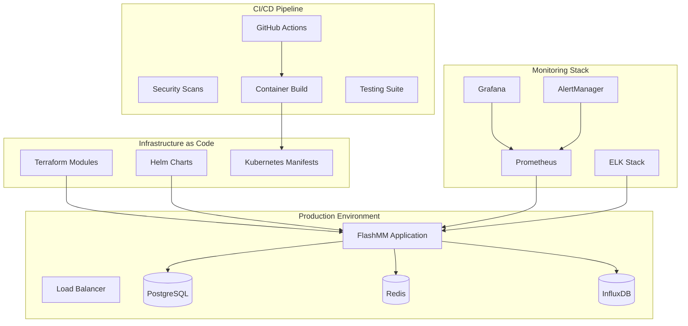

# FlashMM Deployment Infrastructure Guide

## 📋 Overview

This guide provides comprehensive documentation for deploying and managing FlashMM in production environments. The deployment infrastructure supports multiple environments, cloud platforms, and deployment patterns with enterprise-grade security, monitoring, and operational capabilities.

## 🏗️ Architecture Overview

### Deployment Components



### Supported Deployment Patterns

| Pattern | Use Case | Complexity | Best For |
|---------|----------|------------|----------|
| **Docker Compose** | Development, quick demos | Low | Local development, prototyping |
| **Single VPS** | Small production, cost-effective | Medium | Startups, small teams |
| **Kubernetes** | Enterprise production | High | Large scale, high availability |
| **Multi-cloud** | Maximum reliability | Very High | Enterprise, compliance requirements |

## 🚀 Quick Start Deployments

### Development Environment

```bash
# Clone repository
git clone https://github.com/flashmm/flashmm.git
cd flashmm

# Start development stack
docker-compose -f docker-compose.dev.yml up -d

# Access services
echo "API: http://localhost:8000"
echo "Grafana: http://localhost:3000"
echo "Redis UI: http://localhost:8081"
```

### Staging Environment

```bash
# Deploy to staging using Helm
./environments/deploy.sh -e staging

# Verify deployment
./scripts/health-check.sh -e staging

# Run tests
./tests/deployment/run_all_tests.sh -e staging --quick
```

### Production Environment

```bash
# Deploy infrastructure with Terraform
cd terraform/
terraform init
terraform apply -var="environment=production"

# Deploy application with Helm
./environments/deploy.sh -e production

# Run comprehensive validation
./tests/deployment/run_all_tests.sh -e production --full
```

## 🎯 Deployment Methods

### Method 1: Docker Compose (Recommended for Development)

**Environments Available:**
- [`docker-compose.dev.yml`](../../docker-compose.dev.yml) - Development with hot reload
- [`docker-compose.staging.yml`](../../docker-compose.staging.yml) - Staging-like environment
- [`docker-compose.prod.yml`](../../docker-compose.prod.yml) - Production-ready setup

**Quick Commands:**
```bash
# Development
make dev-up
docker-compose -f docker-compose.dev.yml up -d

# Staging
docker-compose -f docker-compose.staging.yml up -d

# Production  
docker-compose -f docker-compose.prod.yml up -d
```

**Configuration:**
1. Copy [`.env.template`](../../.env.template) to `.env`
2. Configure environment-specific values
3. Update service passwords and API keys
4. Start services with docker-compose

### Method 2: Kubernetes (Recommended for Production)

**Components:**
- **Namespaces:** [`k8s/namespace.yaml`](../../k8s/namespace.yaml)
- **Deployments:** [`k8s/deployment.yaml`](../../k8s/deployment.yaml)
- **Services:** [`k8s/service.yaml`](../../k8s/service.yaml)
- **Storage:** [`k8s/persistentvolume.yaml`](../../k8s/persistentvolume.yaml)
- **Security:** [`k8s/rbac.yaml`](../../k8s/rbac.yaml)
- **Networking:** [`k8s/ingress.yaml`](../../k8s/ingress.yaml)
- **Scaling:** [`k8s/hpa.yaml`](../../k8s/hpa.yaml)

**Deployment Steps:**
```bash
# 1. Apply base infrastructure
kubectl apply -f k8s/namespace.yaml
kubectl apply -f k8s/rbac.yaml
kubectl apply -f k8s/persistentvolume.yaml

# 2. Configure secrets
kubectl apply -f k8s/secrets.yaml
# Edit secrets with actual values:
kubectl edit secret flashmm-secrets -n flashmm

# 3. Apply configurations
kubectl apply -f k8s/configmap.yaml

# 4. Deploy applications
kubectl apply -f k8s/deployment.yaml
kubectl apply -f k8s/service.yaml

# 5. Configure networking
kubectl apply -f k8s/ingress.yaml

# 6. Enable autoscaling
kubectl apply -f k8s/hpa.yaml

# 7. Verify deployment
kubectl rollout status deployment/flashmm-app -n flashmm
```

### Method 3: Helm Charts (Recommended for Complex Deployments)

**Chart Structure:**
```
helm/flashmm/
├── Chart.yaml              # Chart metadata
├── values.yaml             # Default configuration
├── templates/              # Kubernetes templates
└── charts/                 # Sub-charts
```

**Environment-Specific Deployments:**
```bash
# Development
helm install flashmm ./helm/flashmm/ \
  -f environments/development/values.yaml \
  -n flashmm-dev --create-namespace

# Staging
helm install flashmm ./helm/flashmm/ \
  -f environments/staging/values.yaml \
  -n flashmm-staging --create-namespace

# Production
helm install flashmm ./helm/flashmm/ \
  -f environments/production/values.yaml \
  -n flashmm --create-namespace
```

**Custom Values:**
```bash
# Deploy with custom configuration
helm install flashmm ./helm/flashmm/ \
  --set flashmm.replicaCount=5 \
  --set monitoring.enabled=true \
  --set backup.enabled=true \
  -n flashmm
```

### Method 4: Infrastructure as Code (Terraform)

**Multi-Cloud Support:**
- **AWS:** EKS, RDS, ElastiCache, VPC, Security Groups
- **GCP:** GKE, Cloud SQL, Memorystore, VPC, Firewall Rules  
- **Azure:** AKS, PostgreSQL, Redis Cache, VNet, NSGs

**Deployment Process:**
```bash
# 1. Initialize Terraform
cd terraform/
terraform init

# 2. Plan deployment
terraform plan \
  -var="environment=production" \
  -var="cloud_provider=aws" \
  -out=production.tfplan

# 3. Apply infrastructure
terraform apply production.tfplan

# 4. Configure kubectl
aws eks update-kubeconfig --region us-east-1 --name flashmm-production

# 5. Deploy application
helm install flashmm ./helm/flashmm/ \
  -f environments/production/values.yaml
```

## 🔧 Operational Procedures

### Daily Operations

**Health Monitoring:**
```bash
# Quick health check
./scripts/health-check.sh -e production

# Detailed health check with metrics
./scripts/health-check.sh -e production -t full -f json

# Check specific components
./scripts/health-check.sh -e production -t external
```

**Log Management:**
```bash
# View application logs
kubectl logs -f deployment/flashmm-app -n flashmm

# View aggregated logs in Kibana
# Access: https://kibana.flashmm.com

# Export logs for analysis
kubectl logs deployment/flashmm-app -n flashmm --since=1h > flashmm-logs.txt
```

**Performance Monitoring:**
```bash
# Resource usage
kubectl top pods -n flashmm

# Application metrics
curl https://api.flashmm.com/metrics

# Trading performance dashboard
# Access: https://grafana.flashmm.com/d/flashmm-overview
```

### Scaling Operations

**Manual Scaling:**
```bash
# Scale up for high load
./scripts/scale.sh up 5 -e production

# Scale down during low activity
./scripts/scale.sh down 2 -e production

# Emergency scaling
./scripts/scale.sh emergency-scale -e production

# Configure auto-scaling
./scripts/scale.sh auto -e production
```

**Auto-scaling Configuration:**
```yaml
# HPA configuration in environments/production/values.yaml
autoscaling:
  enabled: true
  minReplicas: 3
  maxReplicas: 10
  targetCPUUtilizationPercentage: 70
  targetMemoryUtilizationPercentage: 80
  customMetrics:
    - type: Pods
      pods:
        metric:
          name: trading_requests_per_second
        target:
          type: AverageValue
          averageValue: "100"
```

### Backup and Recovery

**Automated Backups:**
```bash
# Configure automatic backups (runs daily at 1 AM)
# Configured in environments/production/values.yaml:
backup:
  enabled: true
  schedule: "0 1 * * *"
  retention: "90d"
  s3:
    bucket: "flashmm-prod-backups"
    region: "us-east-1"
```

**Manual Backup:**
```bash
# Full backup
./scripts/backup.sh -e production -t full

# Data-only backup
./scripts/backup.sh -e production -t data

# Configuration backup
./scripts/backup.sh -e production -t config

# Verify backup integrity
./scripts/backup.sh -e production -t full --verify
```

**Recovery Procedures:**
```bash
# List available backups
aws s3 ls s3://flashmm-prod-backups/production/

# Restore from backup
./scripts/restore.sh -e production -b 20240120_020000

# Point-in-time recovery
./scripts/restore.sh -e production --pit "2024-01-20 02:00:00"
```

### Deployment and Updates

**Zero-Downtime Deployment:**
```bash
# Production deployment with backup
./scripts/deploy-production.sh --image-tag v1.2.0

# Staging deployment
./environments/deploy.sh -e staging

# Development deployment
./environments/deploy.sh -e development
```

**Rollback Procedures:**
```bash
# Rollback to previous version
./scripts/rollback.sh -e production

# Rollback to specific revision
./scripts/rollback.sh -e production -r 5

# List available revisions
./scripts/rollback.sh --list-revisions

# Helm-based rollback
./scripts/rollback.sh --helm-rollback -e production
```

## 🔒 Security Operations

### Security Scanning

**Automated Scanning:**
```bash
# Comprehensive security scan
./security/scripts/security-scan.sh -e production -t full

# Compliance validation
./security/scripts/security-scan.sh -e production -t compliance -c soc2

# Quick security check
./security/scripts/security-scan.sh -e production -t quick

# Security scan with remediation
./security/scripts/security-scan.sh -e production --remediation
```

**Manual Security Checks:**
```bash
# Check pod security contexts
kubectl get pods -n flashmm -o jsonpath='{.items[*].spec.securityContext}'

# Verify network policies
kubectl get networkpolicy -n flashmm

# Check RBAC configuration
kubectl get roles,rolebindings -n flashmm

# Audit cluster security
kubectl get clusterroles | grep flashmm
```

### Certificate Management

**TLS Certificate Monitoring:**
```bash
# Check certificate expiration
kubectl get certificates -n flashmm

# Cert-manager status
kubectl get clusterissuer letsencrypt-prod

# Manual certificate renewal (if needed)
kubectl annotate certificate flashmm-tls -n flashmm \
  cert-manager.io/issue-temporary-certificate=true --overwrite
```

## 📊 Monitoring and Alerting

### Monitoring Stack Access

| Component | URL | Purpose |
|-----------|-----|---------|
| **Grafana** | https://grafana.flashmm.com | Dashboards and visualization |
| **Prometheus** | https://prometheus.flashmm.com | Metrics and queries |
| **AlertManager** | https://alertmanager.flashmm.com | Alert management |
| **Kibana** | https://kibana.flashmm.com | Log analysis and search |

### Key Dashboards

1. **FlashMM Overview** (`flashmm-overview`)
   - System health status
   - Trading performance metrics
   - Resource utilization
   - Error rates and latency

2. **Infrastructure Monitoring** 
   - Kubernetes cluster health
   - Node resource usage
   - Network traffic
   - Storage utilization

3. **Security Dashboard**
   - Authentication events
   - Security alerts
   - Compliance status
   - Vulnerability tracking

### Alert Configuration

**Critical Alerts (Immediate Response):**
- FlashMM application down
- Database connectivity lost
- High error rates (>5%)
- Security incidents
- Trading engine failures

**Warning Alerts (Monitor Closely):**
- High resource usage (>80%)
- Increased response latency
- External API issues
- Certificate expiration (30 days)

**Configuration Files:**
- Prometheus alerts: [`monitoring/prometheus/rules/flashmm-alerts.yml`](../../monitoring/prometheus/rules/flashmm-alerts.yml)
- AlertManager config: [`monitoring/alertmanager/alertmanager.yml`](../../monitoring/alertmanager/alertmanager.yml)

## 🧪 Testing and Validation

### Test Suites Available

1. **Infrastructure Tests:** [`tests/deployment/test_infrastructure.py`](../../tests/deployment/test_infrastructure.py)
2. **Performance Tests:** [`tests/performance/load_test.py`](../../tests/performance/load_test.py)
3. **Security Tests:** [`security/scripts/security-scan.sh`](../../security/scripts/security-scan.sh)

### Running Tests

**Comprehensive Test Suite:**
```bash
# Run all tests
./tests/deployment/run_all_tests.sh -e staging --full

# Quick validation
./tests/deployment/run_all_tests.sh -e production --quick

# Security-focused testing
./tests/deployment/run_all_tests.sh -t security -e production

# Performance testing
python3 tests/performance/load_test.py --kubernetes --namespace flashmm
```

**Individual Test Categories:**
```bash
# Infrastructure validation
python3 tests/deployment/test_infrastructure.py -e production -v

# Load testing
python3 tests/performance/load_test.py --base-url https://api.flashmm.com --users 100

# Security compliance
./security/scripts/security-scan.sh -e production -t compliance -c soc2,iso27001
```

## 🔐 Security and Compliance

### Security Policies

**Network Security:**
- Network policies: [`security/policies/network-policy.yaml`](../../security/policies/network-policy.yaml)
- Ingress TLS termination
- Service mesh mTLS (optional)

**Pod Security:**
- Pod Security Standards: [`security/policies/pod-security-policy.yaml`](../../security/policies/pod-security-policy.yaml)
- Security contexts and constraints
- Runtime security monitoring

**Compliance Frameworks:**
- SOC2 Type II
- ISO 27001
- PCI DSS (where applicable)
- GDPR compliance

### Secrets Management

**Kubernetes Secrets:**
```bash
# Create secrets from template
kubectl apply -f k8s/secrets.yaml

# Update production secrets
kubectl create secret generic flashmm-secrets \
  --from-literal=SEI_PRIVATE_KEY="your-private-key" \
  --from-literal=CAMBRIAN_API_KEY="your-api-key" \
  --dry-run=client -o yaml | kubectl apply -f -

# Use external secrets operator (recommended)
kubectl apply -f security/external-secrets-config.yaml
```

**HashiCorp Vault Integration:**
```yaml
# External Secrets configuration
apiVersion: external-secrets.io/v1beta1
kind: SecretStore
metadata:
  name: vault-backend
spec:
  provider:
    vault:
      server: "https://vault.flashmm.com"
      path: "secret"
      version: "v2"
```

## ☁️ Multi-Cloud Deployment

### AWS Deployment

```bash
# Configure AWS CLI
aws configure

# Deploy infrastructure
cd terraform/
terraform init
terraform apply -var="cloud_provider=aws" \
  -var="aws_region=us-east-1" \
  -var="environment=production"

# Configure kubectl
aws eks update-kubeconfig --region us-east-1 --name flashmm-production

# Deploy application
helm install flashmm ./helm/flashmm/ \
  -f environments/production/values.yaml
```

### Google Cloud Deployment

```bash
# Configure gcloud
gcloud auth login
gcloud config set project flashmm-prod

# Deploy infrastructure  
cd terraform/
terraform apply -var="cloud_provider=gcp" \
  -var="gcp_project_id=flashmm-prod" \
  -var="gcp_region=us-central1"

# Configure kubectl
gcloud container clusters get-credentials flashmm-production --region us-central1

# Deploy application
helm install flashmm ./helm/flashmm/ \
  -f environments/production/values.yaml
```

### Azure Deployment

```bash
# Login to Azure
az login

# Deploy infrastructure
cd terraform/
terraform apply -var="cloud_provider=azure" \
  -var="azure_location=East US" \
  -var="environment=production"

# Configure kubectl
az aks get-credentials --resource-group flashmm-prod --name flashmm-production

# Deploy application  
helm install flashmm ./helm/flashmm/ \
  -f environments/production/values.yaml
```

## 🛠️ Troubleshooting Guide

### Common Issues

**Application Won't Start:**
```bash
# Check pod status
kubectl describe pods -n flashmm -l app.kubernetes.io/name=flashmm

# Check logs
kubectl logs -f deployment/flashmm-app -n flashmm

# Check resource constraints
kubectl top pods -n flashmm
kubectl describe nodes
```

**Database Connection Issues:**
```bash
# Test database connectivity
kubectl exec -n flashmm deployment/postgres -- pg_isready -U flashmm

# Check database logs
kubectl logs -f deployment/postgres -n flashmm

# Test from application pod
kubectl exec -n flashmm deployment/flashmm-app -- \
  pg_isready -h postgres -p 5432 -U flashmm
```

**Performance Issues:**
```bash
# Check resource usage
kubectl top pods -n flashmm
kubectl top nodes

# Check HPA status
kubectl get hpa -n flashmm

# Review metrics
curl https://api.flashmm.com/metrics | grep -E "(latency|rps|error)"
```

**Security Alerts:**
```bash
# Review security events
kubectl get events -n flashmm --field-selector type=Warning

# Check Falco alerts (if installed)
kubectl logs -n falco-system daemonset/falco

# Run security audit
./security/scripts/security-scan.sh -e production -t full
```

### Emergency Procedures

**System Down:**
1. Check overall cluster health: `kubectl get nodes`
2. Check FlashMM pods: `kubectl get pods -n flashmm`
3. Check recent events: `kubectl get events -n flashmm --sort-by='.lastTimestamp'`
4. Scale up if needed: `./scripts/scale.sh emergency-scale`
5. Check external dependencies: `./scripts/health-check.sh -t external`

**High Load:**
1. Enable emergency scaling: `./scripts/scale.sh emergency-scale`
2. Monitor resource usage: `kubectl top pods -n flashmm`
3. Check alert status: Access AlertManager dashboard
4. Review performance metrics: Access Grafana dashboards

**Security Incident:**
1. Run security scan: `./security/scripts/security-scan.sh -t full`
2. Check for suspicious activity: Review Kibana logs
3. Isolate affected components: Apply network policies
4. Generate incident report: Document findings and actions

### Performance Tuning

**Database Optimization:**
```sql
-- PostgreSQL performance tuning
ALTER SYSTEM SET shared_buffers = '256MB';
ALTER SYSTEM SET effective_cache_size = '1GB';
ALTER SYSTEM SET maintenance_work_mem = '64MB';
SELECT pg_reload_conf();
```

**Redis Optimization:**
```bash
# Configure Redis for high performance
kubectl patch configmap redis-config -n flashmm --patch '
data:
  redis.conf: |
    maxmemory 4gb
    maxmemory-policy allkeys-lru
    tcp-keepalive 60
    timeout 0
'
```

**Application Tuning:**
```yaml
# Resource optimization in values.yaml
flashmm:
  resources:
    requests:
      memory: "2Gi"
      cpu: "1"
    limits:
      memory: "8Gi" 
      cpu: "4"
  
  config:
    trading:
      quoteFrequencyHz: 20.0  # Increase for higher throughput
    ml:
      inferenceTimeoutMs: 3   # Reduce for lower latency
```

## 📈 Monitoring and Metrics

### Key Performance Indicators (KPIs)

**Trading Performance:**
- Orders per second (target: >100 OPS)
- Fill rate (target: >95%)
- Spread improvement vs baseline (target: >10%)
- P&L tracking (real-time)

**System Performance:**
- API response time P95 (target: <100ms)
- System availability (target: >99.9%)
- Error rate (target: <0.1%)
- Resource utilization (target: <80%)

**Business Metrics:**
- Trading volume (24h)
- Profit margins
- Market capture rate
- Risk-adjusted returns

### Alerting Thresholds

**Critical (Immediate Action):**
- Service down >1 minute
- Error rate >5%
- P95 latency >500ms
- Database connectivity lost
- Security incidents

**Warning (Monitor Closely):**
- CPU usage >80% for 5 minutes
- Memory usage >85% for 5 minutes
- Disk usage >90%
- Certificate expiring <30 days

## 🎛️ Configuration Management

### Environment Configuration

**File Structure:**
```
environments/
├── development/
│   └── values.yaml          # Dev-specific configuration
├── staging/ 
│   └── values.yaml          # Staging configuration
├── production/
│   └── values.yaml          # Production configuration
└── deploy.sh                # Unified deployment script
```

**Configuration Hierarchy:**
1. **Default values:** [`helm/flashmm/values.yaml`](../../helm/flashmm/values.yaml)
2. **Environment overrides:** `environments/{env}/values.yaml`
3. **Runtime secrets:** Kubernetes secrets
4. **Feature flags:** ConfigMaps

### Secret Rotation

**Automated Rotation:**
```bash
# Database passwords (monthly)
# Configure in environments/production/values.yaml:
secrets:
  rotation:
    enabled: true
    schedule: "0 2 1 * *"  # First day of month at 2 AM
```

**Manual Rotation:**
```bash
# Rotate API keys
kubectl create secret generic flashmm-secrets-new \
  --from-literal=CAMBRIAN_API_KEY="new-api-key" \
  --dry-run=client -o yaml | kubectl apply -f -

# Rolling update to use new secrets
kubectl rollout restart deployment/flashmm-app -n flashmm
```

## 🔧 Maintenance Procedures

### Regular Maintenance Tasks

**Weekly:**
- Review monitoring dashboards
- Check backup status
- Update dependencies
- Review security alerts

**Monthly:**
- Rotate secrets and certificates
- Update container images
- Performance review and tuning
- Disaster recovery testing

**Quarterly:**
- Full security audit
- Compliance assessment
- Infrastructure cost optimization
- Capacity planning review

### Update Procedures

**Application Updates:**
```bash
# Update to new version
helm upgrade flashmm ./helm/flashmm/ \
  --set global.imageTag=v1.3.0 \
  -f environments/production/values.yaml

# Monitor rollout
kubectl rollout status deployment/flashmm-app -n flashmm

# Verify update
./scripts/health-check.sh -e production
```

**Infrastructure Updates:**
```bash
# Update Kubernetes cluster
# Follow cloud provider specific procedures

# Update Terraform modules
cd terraform/
terraform plan
terraform apply

# Update Helm charts
helm repo update
helm upgrade flashmm ./helm/flashmm/
```

## 📚 Additional Resources

### Documentation Links
- **Architecture:** [`architecture-overview.md`](../../architecture-overview.md)
- **Security:** [`security-architecture.md`](../../security-architecture.md) 
- **Configuration:** [`configuration-management.md`](../../configuration-management.md)
- **API Specs:** [`api-specifications.md`](../../api-specifications.md)

### External Dependencies
- **Sei Network:** [Documentation](https://docs.sei.io/)
- **Cambrian SDK:** [API Documentation](https://docs.cambrian.com/)
- **Azure OpenAI:** [Service Documentation](https://docs.microsoft.com/azure/cognitive-services/openai/)

### Support and Escalation

**Incident Response:**
1. **P0 (Critical):** System down, data loss risk
   - Immediate response required
   - Escalate to on-call engineer
   - Follow emergency procedures

2. **P1 (High):** Performance degradation, security issues
   - Response within 4 hours
   - Monitor and investigate
   - Apply fixes during maintenance window

3. **P2 (Medium):** Non-critical bugs, feature requests
   - Response within 24 hours
   - Plan fixes for next release

**Contact Information:**
- **Operations Team:** ops@flashmm.com
- **Security Team:** security@flashmm.com
- **On-call Engineer:** Use PagerDuty escalation

---

## 🎉 Conclusion

This deployment infrastructure provides enterprise-grade capabilities for running FlashMM in production environments. The combination of containerization, orchestration, infrastructure as code, comprehensive monitoring, and automated testing ensures reliable, secure, and scalable operations.

For questions or issues, consult the troubleshooting section or contact the operations team.

**Happy Trading! 🚀**